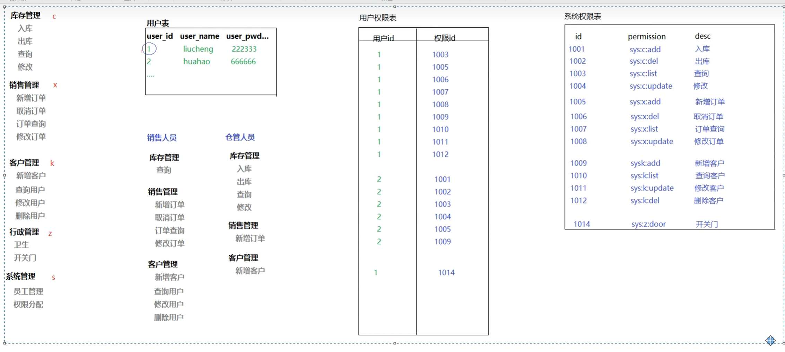
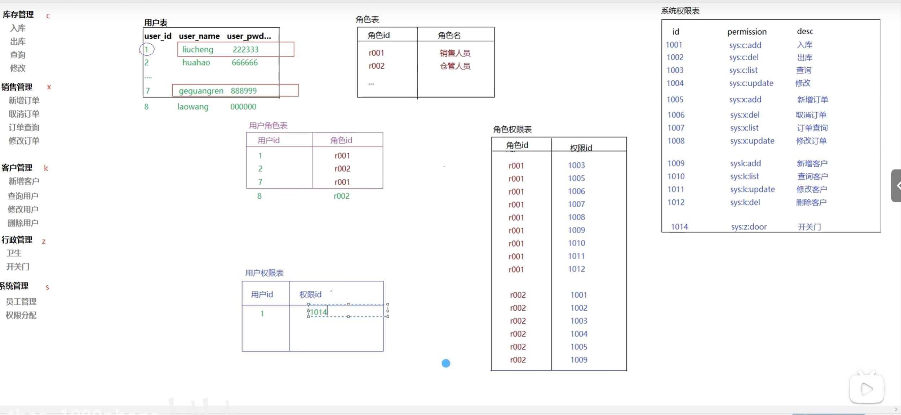
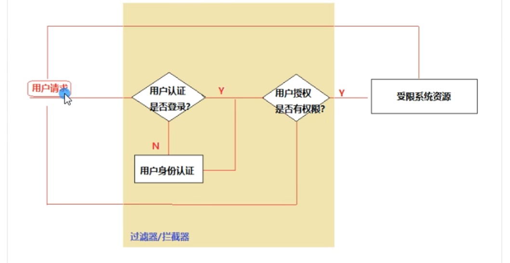
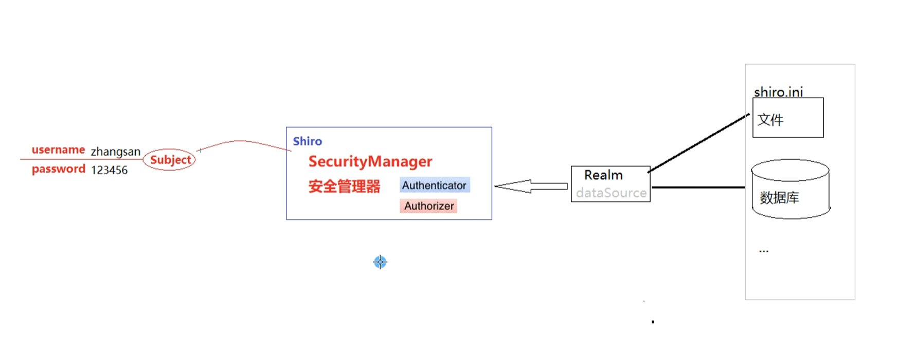
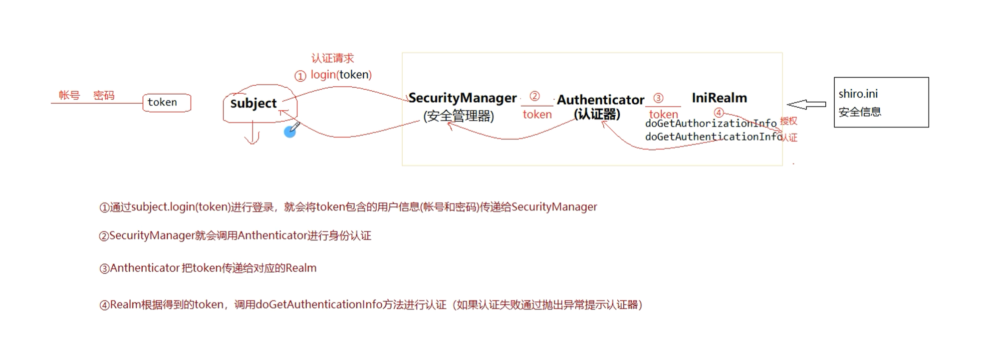
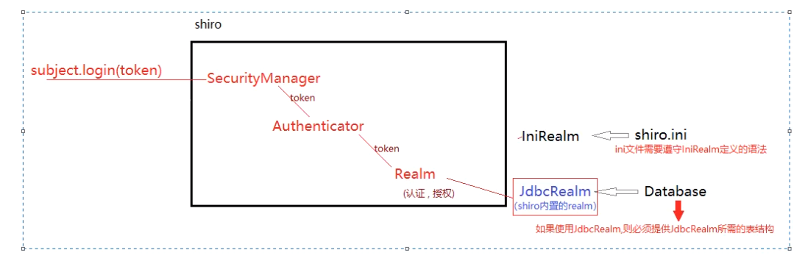

## shiro

#### 权限管理的解决方案

> 权限管理设计

####   基于主页的权限管理

- 适用于权限管理比较单一，用户少，每类用户权限固定

#### 基于用户和权限的管理

- 可以实现权限的动态分配，但是不够灵活

#### 基于角色的访问控制

### shiro简介

#### 认证授权流程

- 认证：对用户的身份进行检查（登录检查）

- 授权：对用户的权限进行检查（是否有对应的操作权限）

  

####  安全框架

常用的安全框架

- shiro
- spring security
- oauth2  第三方授权登录
- 自定义的

#### shiro

完成用户认证、授权、密码及会话管理

### shiro的工作原理

---

#### shiro的核心功能

- Authentication 认证   登录认证
- Authorization  授权    对已经登录的用户（通过认证的用户） 检查是否具有某个角色或权限
- Session Management  会话管理功能
- Crytography  密码管理
- 支持的特性
  - 提供了过滤器，可以处理web应用的访问控制
  - Caching 缓存
  - Concurrency 多线程
  - testing 测试支持
  - Run As  伪装访问
  - Remeber Me 记住我

#### shiro的核心组件

- subject   主体

- Security Manager  安全管理器

- Realm    相当于shiro进行认证和授权与数据源之间的桥梁

  SecurityUtils  帮助工具类

  

~~~java
 Scanner scanner = new Scanner(System.in);
        System.out.println("请输入账号：");
        String userName = scanner.nextLine();
        System.out.println("请输入密码：");
        String password = scanner.nextLine();
        System.out.println("============================");

        //创建安全管理器
        DefaultSecurityManager defaultSecurityManager = new DefaultSecurityManager();
        //创建Realm
        IniRealm iniRealm = new IniRealm("classpath:shiro.ini");
        //把realm设置给安全管理器
        defaultSecurityManager.setRealm(iniRealm);
        //把Realm设置给SecurityUtils 工具类
        SecurityUtils.setSecurityManager(defaultSecurityManager);
        //通过securityUtils获取subject对象
        Subject subject = SecurityUtils.getSubject();

        //认证流程
        //把认证账号和密码封装到token中
        UsernamePasswordToken token = new UsernamePasswordToken(userName, password);
        //通过subject对象调用login方法进行认证
        subject.login(token);

      //授权
        //判断是否有某个角色
        System.out.println(subject.hasRole("seller"));
        //判断是否有某个权限
        System.out.println(subject.isPermitted("order:del"));
~~~

### spring boot 整合shiro

整合Druid和Mybatis

~~~xml
        <dependency>
            <groupId>com.alibaba</groupId>
            <artifactId>druid-spring-boot-starter</artifactId>
            <version>1.2.11</version>
        </dependency>
        <dependency>
            <groupId>mysql</groupId>
            <artifactId>mysql-connector-java</artifactId>
            <version>8.0.18</version>
        </dependency>
        <dependency>
            <groupId>com.baomidou</groupId>
            <artifactId>mybatis-plus-boot-starter</artifactId>
            <version>3.0.5</version>
        </dependency>
~~~

进行相关配置

~~~yml
spring:
  datasource:
    druid:
      url: jdbc:mysql://127.0.0.1:3306/shirodb
      driver-class-name: com.mysql.cj.jdbc.Driver
      username: root
      password: 000000
      initial-size: 1
      min-idle: 1
      max-active: 20
mybatis:
  mapper-locations: classpath:mappers/*Mapper.xml
  type-aliases-package: com.hatu.shiro1.beans
~~~

整合

- 导入shiro依赖

  ~~~xml
    <dependency>
       <groupId>org.apache.shiro</groupId>
       <artifactId>shiro-spring</artifactId>
       <version>1.4.0</version>
  </dependency>
  ~~~

  

- 配置shiro过滤器，拦截需要认证和授权的用户请求

- 配置SecurityManager到spring容器

- 配置Realm

- realm从哪里来？    可以是shiro提供，或自定义

#### JDBCRealm及其表结构

如果使用jdbcRealm，则必须提供jdbcRealm所需的表结构（权限设计）

jdbcRealm规定的表结构

- 用户表:users

~~~sql
create table users(
	id int primary key auto_increment,
    username varchar(60) not null unique,
    password varchar(20) not null,
    password_salt varchar(20)
);
~~~

- 角色信息表:user_roles

~~~sql
create table user_roles(
id int primary key auto_increment,
username varchar(60) not null,
    role_name varchar(100) not null
);
~~~

- 权限信息表 :roles_permissions

~~~sql
create table roles_permissions(
id int primary key auto_increment,
    role_name varchar(100) not null,
    perssion varchar(100) not null
);
~~~

写入测试数据

~~~sql
INSERT INTO users(username,password) VALUES('zhangsan','123456');
INSERT INTO users(username,password) VALUES('lisi','123456');
INSERT INTO users(username,password) VALUES('hatu','123456');
INSERT INTO users(username,password) VALUES('wangwu','123456');
INSERT INTO users(username,password) VALUES('zhaoliu','123456');

INSERT INTO user_roles(username,role_name) values('hatu','admin');
INSERT INTO user_roles(username,role_name) values('zhangsan','cmgr');
INSERT INTO user_roles(username,role_name) values('lisi','xmgr');
INSERT INTO user_roles(username,role_name) values('wangwu','kmgr');
INSERT INTO user_roles(username,role_name) values('zhaoliu','zmgr');

-- 管理员
INSERT INTO roles_permissions(role_name,permission) values('admin','*');
-- 库管人员
INSERT INTO roles_permissions(role_name,permission) values('cmgr','sys:c:save');
INSERT INTO roles_permissions(role_name,permission) values('cmgr','sys:c:delete');
INSERT INTO roles_permissions(role_name,permission) values('cmgr','sys:c:update');
INSERT INTO roles_permissions(role_name,permission) values('cmgr','sys:c:find');
-- 销售人员
INSERT INTO roles_permissions(role_name,permission) values('xmgr','sys:c:find');
INSERT INTO roles_permissions(role_name,permission) values('xmgr','sys:x:save');
INSERT INTO roles_permissions(role_name,permission) values('xmgr','sys:x:delete');
INSERT INTO roles_permissions(role_name,permission) values('xmgr','sys:x:update');
INSERT INTO roles_permissions(role_name,permission) values('xmgr','sys:x:find');

INSERT INTO roles_permissions(role_name,permission) values('xmgr','sys:k:save');
INSERT INTO roles_permissions(role_name,permission) values('xmgr','sys:k:delete');
INSERT INTO roles_permissions(role_name,permission) values('xmgr','sys:k:update');
INSERT INTO roles_permissions(role_name,permission) values('xmgr','sys:x:find');

-- 客服人员
INSERT INTO roles_permissions(role_name,permission) values('kmgr','sys:k:find');
INSERT INTO roles_permissions(role_name,permission) values('kmgr','sys:k:update');
-- 行政人员
INSERT INTO roles_permissions(role_name,permission) values('zmgr','sys:*:find');
~~~

config配置

~~~java
@Configuration
public class ShiroConfig {

    /**
     * @return 获取数据信息
     */
    @Bean
    public JdbcRealm getJdbcRealm(DataSource dataSource) {
        JdbcRealm jdbcRealm = new JdbcRealm();
        jdbcRealm.setDataSource(dataSource);
        //jdbc默认开启认证功能，需要手动开启授权功能
        jdbcRealm.setPermissionsLookupEnabled(true);
        return jdbcRealm;
    }

    /**
     * @return 创建一个securityManager  交给filter使用
     */
    @Bean
    public DefaultWebSecurityManager getDefaultWebSecurityManager(JdbcRealm jdbcRealm) {
        //securityManager完成校验，需要realm
        DefaultWebSecurityManager securityManager = new DefaultWebSecurityManager();
        securityManager.setRealm(jdbcRealm);
        return securityManager;
    }

    /**
     * @param securityManager SecurityManager
     * @return 过滤器
     * @Description: anon   匿名用户访问；authc 认证用户可以访问   user remeberme用户可访问
     * perms  对应权限可以访问   role  对应角色可以访问
     */
    @Bean
    public ShiroFilterFactoryBean shiroFilter(DefaultWebSecurityManager securityManager) {
        ShiroFilterFactoryBean filter = new ShiroFilterFactoryBean();
        //过滤器是shiro权限验证的核心，进行认证需要SecurityManager
        filter.setSecurityManager(securityManager);
        //设置shiro的拦截规则
        HashMap<String, String> filterMap = new HashMap<>();
        filterMap.put("/", "anon");
        filterMap.put("/login", "anon");
        filterMap.put("/user/login", "anon");
        filterMap.put("/static/**", "anon");
        filterMap.put("/users/**", "authc");
        filter.setFilterChainDefinitionMap(filterMap);
        filter.setLoginUrl("/login.html");
        //设置未授权的访问路径
        filter.setUnauthorizedUrl("/");
        return filter;
    }
}
~~~

#### shiro的标签使用

> 当用户认证完进入主页面后，需要显示当前用的权限信息，shiro提供了一套标签，在页面进行权限数据的呈现

- jsp页面中

~~~jsp
<%@ taglib prefix="shiro" url="htp://shiro.apche.org/tags" %>
    <shiro:tag> </shiro:tag>
~~~

- thymeleaf中使用
  - 在pom.xml中导入thymeleaf对shiro标签支持的依赖

~~~xml
<dependency>
	<groupId>org.mybatis.spring.boot</groupId>
	<artifactId>mybatis-spring-boot-starter</artifactId>
	<version>2.2.0</version>
</dependency>
~~~

在shiroconfig中配置兼容

~~~java
    @Bean
    public ShiroDialect getShiroDialect() {
        return new ShiroDialect();
    }
~~~

在thyemleaf中引入shiro的命名空间

~~~html
<html xmlns:th="www.thymeleaf.org"
      xmlns:shiro="http://www.pollix.at/thyemeleaf/shiro">
    
</html>
~~~

常用标签

- guest  游客身份   如果是游客身份则显示标签内内容，登录则不显示

~~~xml
<shiro:guest>
    欢迎游客访问，<a href="login.html">登录</a>
</shiro:guest>
~~~

- user  已经登录的账户
- principal  获取已登录的用户名

~~~xml
<shiro:user>
     <shiro:principal/>欢迎登录
</shiro:user>
~~~

- hasRole
- hasPermission

~~~xml
  <!DOCTYPE html>
<html lang="en"  xmlns:th="www.thymeleaf.org"
                 xmlns:shiro="http://www.pollix.at/thyemeleaf/shiro">
<head>
    <meta charset="UTF-8">
    <title>Title</title>
</head>
<body>
<h1>访问首页</h1>

<shiro:guest>
    欢迎游客访问，<a href="login.html">登录</a>
</shiro:guest>
<shiro:user>
    <shiro:principal/>  欢迎登录 

    当前用户身份为: <shiro:hasRole name="admin">超级管理员</shiro:hasRole>
                 <shiro:hasRole name="cmgr">仓库管理员</shiro:hasRole>
                 <shiro:hasRole name="xmgr">销售人员</shiro:hasRole>
                 <shiro:hasRole name="kmgr">客服人员</shiro:hasRole>
                 <shiro:hasRole name="zmgr">行政人员</shiro:hasRole>
</shiro:user>

仓库管理
<ul>
    <shiro:hasPermission name="sys:c:save"><li><a href="#">入库</a></li></shiro:hasPermission>
    <shiro:hasPermission name="sys:c:delete"><li><a href="#">出库</a></li></shiro:hasPermission>
    <shiro:hasPermission name="sys:c:update"><li><a href="#">修改</a></li></shiro:hasPermission>
    <shiro:hasPermission name="sys:c:find"><li><a href="#">查询</a></li></shiro:hasPermission>
</ul>

订单管理
<ul>
    <shiro:hasPermission name="sys:x:save"><li><a href="#">添加订单</a></li></shiro:hasPermission>
    <shiro:hasPermission name="sys:x:delete"><li><a href="#">删除订单</a></li></shiro:hasPermission>
    <shiro:hasPermission name="sys:x:update"><li><a href="#">修改订单</a></li></shiro:hasPermission>
    <shiro:hasPermission name="sys:x:find"><li><a href="#">查询订单</a></li></shiro:hasPermission>
</ul>

客户管理
<ul>
    <shiro:hasPermission name="sys:k:save"><li><a href="#">添加客户</a></li></shiro:hasPermission>
    <shiro:hasPermission name="sys:k:delete"><li><a href="#">删除客户</a></li></shiro:hasPermission>
    <shiro:hasPermission name="sys:k:update"><li><a href="#">修改客户</a></li></shiro:hasPermission>
    <shiro:hasPermission name="sys:k:find"><li><a href="#">查询客户</a></li></shiro:hasPermission>
</ul>

</body>
</html>
~~~

#### 自定义Realm

##### 数据表的创建语句

~~~sql
-- 用户信息表
create table tb_users(
	uesr_id int primary key auto_increment,
    username varchar(30) not null unique,
    password varchar(30) not null,
    password_salt varchar(60)
);

-- 角色信息表
create table tb_roles(
	role_id int primary key auto_increment,
    role_name varchar(30) not null
);

-- 权限信息表
create table tb_permissions(
	permisison_id int primary key auto_increment,
    permission_code varchar(60) not null,
    permission_name varchar(60)
);

-- 用户角色表
create table tb_urs(
	uid int not null,
    rid int not null
  	--  primary key(uid,rid),
    -- constraint FK_user foreign key(uid) references tb_users(user_id),
    -- constraint FK_role foreign key(rid) references tb_roles(role_id)
);

-- 角色权限表
create table tb_rps(
	rid int not null,
    pid  int not null
);

-- 测试数据
-- 用户信息
insert into tb_users(username,password) values('hatu','123456');
insert into tb_users(username,password) values('zhangsan','123456');
insert into tb_users(username,password) values('lisi','123456');
insert into tb_users(username,password) values('wangwu','123456');
insert into tb_users(username,password) values('zhaoliu','123456');
insert into tb_users(username,password) values('chenqi','123456');

-- 角色信息
insert into tb_roles(role_name) values('admin');
insert into tb_roles(role_name) values('cmgr');
insert into tb_roles(role_name) values('xmgr');
insert into tb_roles(role_name) values('kmgr');
insert into tb_roles(role_name) values('zmgr');

-- 权限信息表
insert into tb_permissions(permission_code,permission_name) values('sys:c:save','入库');
insert into tb_permissions(permission_code,permission_name) values('sys:c:delete','出库');
insert into tb_permissions(permission_code,permission_name) values('sys:c:update','修改库存');
insert into tb_permissions(permission_code,permission_name) values('sys:c:find','查询');

insert into tb_permissions(permission_code,permission_name) values('sys:x:save','新增订单');
insert into tb_permissions(permission_code,permission_name) values('sys:x:delete','删除订单');
insert into tb_permissions(permission_code,permission_name) values('sys:x:update','修改订单');
insert into tb_permissions(permission_code,permission_name) values('sys:x:find','查询订单');

insert into tb_permissions(permission_code,permission_name) values('sys:k:save','新增客户');
insert into tb_permissions(permission_code,permission_name) values('sys:k:delete','删除客户');
insert into tb_permissions(permission_code,permission_name) values('sys:k:update','修改客户信息');
insert into tb_permissions(permission_code,permission_name) values('sys:k:find','查询客户');

-- 用户角色表

insert into tb_urs(uid,rid) values(1,1);
insert into tb_urs(uid,rid) values(1,2);
insert into tb_urs(uid,rid) values(1,3);
insert into tb_urs(uid,rid) values(1,4);
insert into tb_urs(uid,rid) values(1,5);

insert into tb_urs(uid,rid) values(2,2);
insert into tb_urs(uid,rid) values(3,3);
insert into tb_urs(uid,rid) values(4,4);
insert into tb_urs(uid,rid) values(5,5);

-- 角色权限表
-- 仓管
insert into tb_rps(rid,pid) values(2,1);
insert into tb_rps(rid,pid) values(2,2);
insert into tb_rps(rid,pid) values(2,3);
insert into tb_rps(rid,pid) values(2,4);
-- 销售
insert into tb_rps(rid,pid) values(3,4);
insert into tb_rps(rid,pid) values(3,5);
insert into tb_rps(rid,pid) values(3,6);
insert into tb_rps(rid,pid) values(3,7);
insert into tb_rps(rid,pid) values(3,9);
insert into tb_rps(rid,pid) values(3,10);
insert into tb_rps(rid,pid) values(3,11);
insert into tb_rps(rid,pid) values(3,12);
-- 客服
insert into tb_rps(rid,pid) values(4,11);
insert into tb_rps(rid,pid) values(4,12);
-- 行政
insert into tb_rps(rid,pid) values(5,4);
insert into tb_rps(rid,pid) values(5,8);
insert into tb_rps(rid,pid) values(5,12);

~~~

##### 自定义Realm的DAO实现

> 根据用户名查询用户信息，用于认证
>
> 根据用户名查询当前用户的角色列表
>
> 根据用户名查询当前用户的权限列表

###### 查询用户

创建DAO

~~~java
public interface UserDAO {
    public User queryUserByUsername(String username) throws Exception;
}
~~~

配置映射

~~~xml
<?xml version="1.0" encoding="UTF-8" ?>
<!DOCTYPE mapper
        PUBLIC "-//mybatis.org//DTD Mapper 3.0//EN"
        "http://mybatis.org/dtd/mybatis-3-mapper.dtd">
<mapper namespace="com.hatu.shiro3.dao.UserDAO">
    <resultMap id="userMap" type="User">
        <id column="user_id" property="userId"/>
        <id column="username" property="userName"/>
        <id column="password" property="password"/>
        <id column="password_salt" property="passwordSalt"/>
    </resultMap>
    <select id="queryUserByUsername" resultMap="userMap">
        select * from tb_users
        where username=#{username}
    </select>
</mapper>
~~~

###### 根据用户名查询角色列表

创建DAO

~~~java
public interface RoleDAO {
    public Set<String> queryRoleNameByUsername(String username) throws Exception;
}
~~~

配置映射

~~~xml
<?xml version="1.0" encoding="UTF-8" ?>
<!DOCTYPE mapper
        PUBLIC "-//mybatis.org//DTD Mapper 3.0//EN"
        "http://mybatis.org/dtd/mybatis-3-mapper.dtd">
<mapper namespace="com.hatu.shiro3.dao.RoleDAO">
    <select id="queryRoleNameByUsername" resultSets="java.util.Set" resultType="string">
        select role_name
        from tb_users
                 inner join tb_urs
                            on tb_users.user_id = tb_urs.uid
                 inner join tb_roles
                            on tb_urs.rid = tb_roles.role_id
        where tb_users.username = #{username}
    </select>
</mapper>
~~~

###### 根据用户名查询权限

创建DAO

~~~java
public interface PermissionDAO {
    public Set<String> queryPermissionByUsername(String username) throws Exception;
}
~~~

配置映射

~~~xml
<?xml version="1.0" encoding="UTF-8" ?>
<!DOCTYPE mapper
        PUBLIC "-//mybatis.org//DTD Mapper 3.0//EN"
        "http://mybatis.org/dtd/mybatis-3-mapper.dtd">
<mapper namespace="com.hatu.shiro3.dao.PermissionDAO">

    <select id="queryPermissionByUsername" resultSets="java.util.Set" resultType="string">
        select tb_permissions.permission_code
        from tb_users
                 inner join tb_urs on tb_users.user_id = tb_urs.uid
                 inner join tb_roles on tb_urs.rid = tb_roles.role_id
                 inner join tb_rps on tb_roles.role_id = tb_rps.rid
                 inner join tb_permissions on tb_rps.pid = tb_permissions.permisison_id
        where tb_users.username = #{username}

    </select>
</mapper>
~~~

##### 整合shiro

- 导入依赖

~~~xml
		<dependency>
			<groupId>org.apache.shiro</groupId>
			<artifactId>shiro-spring</artifactId>
			<version>1.4.0</version>
		</dependency>

		<dependency>
			<groupId>com.github.theborakompanioni</groupId>
			<artifactId>thymeleaf-extras-shiro</artifactId>
			<version>2.0.0</version>
		</dependency>
~~~

- 配置shiro

~~~java
@Configuration
public class ShiroConfig {

    /**
     * 配置thymeleaf对shiro的支持
     */
    @Bean
    public ShiroDialect getShiroDialect() {
        return new ShiroDialect();
    }

    /**
     * 自定义Realm
     *
     * @return 获取数据信息
     */
    @Bean
    public MyRealm getMyRealm() {
        return new MyRealm();
    }

   
   /**
     * @return 创建一个securityManager  交给filter使用
     * @EhCacheManager 缓存管理配置 
     * @cookieRememberMeManager()  设置cookie  记住我管理器
     */
    @Bean
    public DefaultWebSecurityManager getDefaultWebSecurityManager(MyRealm myRealm,EhCacheManager manager, DefaultWebSessionManager sessionManager) {
        //securityManager完成校验，需要realm
        DefaultWebSecurityManager securityManager = new DefaultWebSecurityManager();
        securityManager.setRealm(myRealm);
        securityManager.setCacheManager(manager);
        securityManager.setSessionManager(sessionManager);
         //设置remember me管理器
        securityManager.setRememberMeManager(cookieRememberMeManager());
        return securityManager;
    }

    /**
     * @param securityManager SecurityManager
     * @return 过滤器
     * @Description: anon   匿名用户访问；authc 认证用户可以访问   user remeberme用户可访问
     * perms  对应权限可以访问   role  对应角色可以访问
     */
    @Bean
    public ShiroFilterFactoryBean shiroFilter(DefaultWebSecurityManager securityManager) {
        ShiroFilterFactoryBean filter = new ShiroFilterFactoryBean();
        //过滤器是shiro权限验证的核心，进行认证需要SecurityManager
        filter.setSecurityManager(securityManager);
        //设置shiro的拦截规则
        Map<String, String> filterMap = new HashMap<>();
        filterMap.put("/", "anon");
        filterMap.put("/index.html", "anon");
        filterMap.put("/login.html", "anon");
        filterMap.put("/register.html", "anon");
        filterMap.put("/user/login", "anon");
        filterMap.put("/user/register", "anon");
        filterMap.put("/layui/**", "anon");
        filterMap.put("/**", "authc");
        filter.setFilterChainDefinitionMap(filterMap);
        filter.setLoginUrl("/login.html");
        //设置未授权的访问路径
        filter.setUnauthorizedUrl("/login.html");
        return filter;
    }
}
~~~

- 自定义realm  （MyRealm）

~~~java
/**
 * 自定义realm  继承AuthorizingRealm类
 * 重写doGetAuthorizationInfo、doGetAuthenticationInfo方法
 * 重写getName方法，返回当前realm的自定义名称
*/

public class MyRealm extends AuthorizingRealm {
    @Resource
    private UserDAO userDAO;
    @Resource
    private RoleDAO roleDAO;
    @Resource
    private PermissionDAO permissionDAO;

    @Override
    public String getName() {
        return "MyRealm";
    }

    /**
     * 获取授权数据
     */
    @Override
    protected AuthorizationInfo doGetAuthorizationInfo(PrincipalCollection principalCollection) {
        //获取当前用户的用户名
        String username = (String) principalCollection.iterator().next();
        try {
            //获取角色列表
            Set<String> roleNames = roleDAO.queryRoleNameByUsername(username);
            //获取权限列表
            Set<String> permission = permissionDAO.queryPermissionByUsername(username);

            SimpleAuthorizationInfo info = new SimpleAuthorizationInfo();
            info.setRoles(roleNames);
            info.setStringPermissions(permission);
            return info;
        } catch (Exception e) {
            throw new RuntimeException(e);
        }
    }

    /**
     * 获取认证数据
     */
    @Override
    protected AuthenticationInfo doGetAuthenticationInfo(AuthenticationToken authenticationToken) throws AuthenticationException {
        //参数authenticationToken 传递的是subject.login（token）
        //获取用户名
        UsernamePasswordToken token = (UsernamePasswordToken) authenticationToken;
        String username = token.getUsername();
        //根据用户名从数据库查询安全信息
        try {
            User user = userDAO.queryUserByUsername(username);
            if (user == null) {
                return null;
            }
            //把查询到的数据封装，给shiro
            SimpleAuthenticationInfo info = new SimpleAuthenticationInfo(
                    //当前用户的用户名
                    username,
                    //从数据库查询到的密码
                    user.getPassword(),
                    //如果用户密码加了盐，则要获取盐
                    ByteSource.Util.bytes(user.getPasswordSalt()),
                	//
                    getName());
            return info;
        } catch (Exception e) {
            throw new RuntimeException(e);
        }
    }
}
~~~

### 加密加盐

~~~java
/**
     * 设置加密规则
     */
    @Bean
    public HashedCredentialsMatcher hashedCredentialsMatcher() {
        HashedCredentialsMatcher matcher = new HashedCredentialsMatcher();
        //matcher就是用来指定加密规则
        //加密方式设置为md5
        matcher.setHashAlgorithmName("md5");
        //hash次数
        matcher.setHashIterations(1);
        return matcher;
    }

    /**
     * 自定义Realm
     *
     * @return 获取数据信息
     */
    @Bean
    public MyRealm getMyRealm(HashedCredentialsMatcher matcher) {
        MyRealm myRealm = new MyRealm();
        //在realm设置加密
        myRealm.setCredentialsMatcher(matcher);
        return myRealm;
    }
~~~

注册时在Controller层的几种加密方式

~~~java
        //加盐加密
        int count = new Random().nextInt(10000) + 10000;
        Md5Hash md5Hash = new Md5Hash(pwd, count+"");
        
        //加盐加密，多次hash
        Md5Hash md5Hash1 = new Md5Hash(pwd, count+"", 3);
        
        //第三种方式
        SimpleHash simpleHash = new SimpleHash("md5", pwd, count, 3);
~~~

### 授权

#### HTML授权

- 在菜单页面之前是当前用户拥有的操作权限的菜单
- shiro标签
  - 导入依赖
  - 配置方言
  - 页面引入命名空间

#### 过滤器授权

~~~java
 filterMap.put("/c_add.html", "perms[sys:c:save]");
~~~

#### 注解授权

 配置spring对shiro 的注解支持

~~~java
/**
     * 注解授权的配置  2个bean
     */
    @Bean
    public DefaultAdvisorAutoProxyCreator advisorAutoProxyCreator() {
        DefaultAdvisorAutoProxyCreator creator = new DefaultAdvisorAutoProxyCreator();
        creator.setProxyTargetClass(true);
        return creator;
    }

    @Bean
    public AuthorizationAttributeSourceAdvisor authorizationAttributeSourceAdvisor(DefaultWebSecurityManager securityManager) {
        AuthorizationAttributeSourceAdvisor advisor = new AuthorizationAttributeSourceAdvisor();
        advisor.setSecurityManager(securityManager);
        return advisor;
    }
~~~

Controller层注解的使用

~~~java
 @RequestMapping("/customer/list")
	//有权限才能访问
    @RequiresPermissions("sys:k:find")
    // @RequiresRoles()
    public String list() {
        System.out.println("客户查询");
        return "customer_list";
    }
~~~

#### 手动授权

具体方法里面用代码验证

### 缓存管理

- 导入依赖

~~~xml
	<dependency>
		<groupId>org.springframework.boot</groupId>
		<artifactId>spring-boot-starter-cache</artifactId>
	</dependency>

	<dependency>
		<groupId>net.sf.ehcache</groupId>
		<artifactId>ehcache</artifactId>
	</dependency>

	<dependency>
		<groupId>org.apache.shiro</groupId>
		<artifactId>shiro-ehcache</artifactId>
		<version>1.4.0</version>
	</dependency>
~~~

- 进行缓存配置

~~~xml
<?xml version="1.0" encoding="UTF-8"?>
<ehcache updateCheck="false" dynamicConfig="false">
    <!--updateCheck是否根据数据库的更新同步更新缓存-->
    <diskStore path="C:\TEMP" />

    <cache name="users"  timeToLiveSeconds="300"  maxEntriesLocalHeap="1000"/>

    <defaultCache name="defaultCache"/> <!--缓存的名称-->
    maxElementsInMemory="10000" <!--内存中缓存的最大Element元素个数-->
    eternal="false" <!--管理器对象是否永久有效，如果为true，timeout属性将不起作用-->
    timeToIdleSeconds="120"<!--缓存在失效前的闲置时间，也就是说缓存管理器闲置时间超过此时间，就自动销毁了-->
    timeToLiveSeconds="120"<!--缓存的有效时间-->
    overflowToDisk="false"<!--设定当内存缓存溢出的时候是否将过期的element缓存到磁盘上-->
    maxElementsOnDisk="100000"<!--磁盘中缓存的最大Element元素个数-->
    diskPersistent="false"
    diskExpiryThreadIntervalSeconds="120"<!--磁盘缓存的清理线程运行间隔，默认是120秒-->
    memoryStoreEvictionPolicy="LRU"/><!--当内存缓存达到最大，有新的element加入的时候，

                  移除缓存中element的策略。默认是LRU，可选的有LFU和FIFO-->
    <!--缓存淘汰策略：当缓存空间比较紧张时，我们要存储新的数据进来，就必然要删除一些老的数据
        LRU 最近最少使用
        FIFO 先进先出
        LFU  最少使用
    -->
</ehcache>
~~~

- 加入缓存管理

~~~java
 /**
     * 配置缓存管理
     */
    @Bean
    public EhCacheManager manager() {
        EhCacheManager ehCacheManager = new EhCacheManager();
        ehCacheManager.setCacheManagerConfigFile("classpath:ehcache.xml");
        return ehCacheManager;
    }

//这里的ehCacheManager要交给securityManager
~~~

### Session管理

自定义session管理器，把自定义的session交给securityManager

~~~java
    /**
     * 自定义session  需要配置给securityManager
     */
    @Bean
    public DefaultWebSessionManager defaultWebSessionManager() {
        DefaultWebSessionManager sessionManager = new DefaultWebSessionManager();
        sessionManager.setGlobalSessionTimeout(60 * 1000);
        return sessionManager;
    }
~~~

### rememberme

- 在过滤器中设置记住我可以访问的页面

~~~java
//    anon   匿名用户访问；authc 认证用户可以访问   user remeberme用户可访问 perms  对应权限可以访问   role  对应角色可以访问
~~~

- 在config配置文件中配置基于cookie的rememberme管理器

~~~java
/**
     * 进行记住我 cookie的配置   需要配置给securityManager
     */
    @Bean
    public CookieRememberMeManager cookieRememberMeManager() {
        CookieRememberMeManager manager = new CookieRememberMeManager();
        SimpleCookie simpleCookie = new SimpleCookie("rememberMe");
        //这里配置一个月时间
        simpleCookie.setMaxAge(30 * 24 * 60 * 60);
        manager.setCookie(simpleCookie);
        return manager;
    }
~~~

### shiro的多Realm配置  

- 链式处理

~~~java
        //先设置多个realm
        //配置多个realm
        Collection<Realm> realms = new ArrayList<>();
        realms.add(myRealm);
        realms.add(userRealm);
        
        securityManager.setRealms(realms);
~~~

- 分支处理

  ~~~java
  //自定义token
  public class MyToken extends UsernamePasswordToken {
      private String loginType;
  
      public MyToken(String userName, String pwd, String loginType) {
          super(userName,pwd);
          this.loginType = loginType;
      }
  
      public String getLoginType() {
          return loginType;
      }
  
      public void setLoginType(String loginType) {
          this.loginType = loginType;
      }
  }
  ~~~

  

