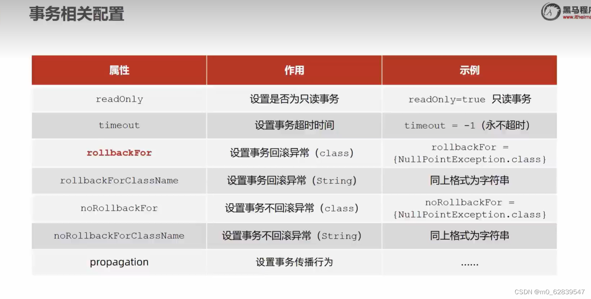
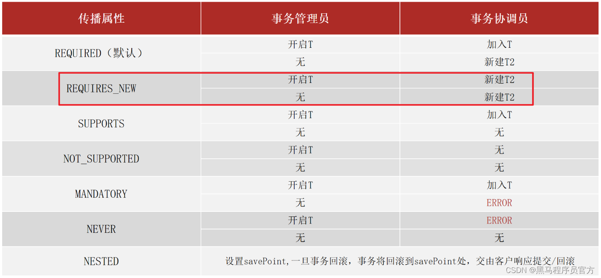

## 核心容器

#### 1.核心概念

- IoC（Inversion of Control）控制反转

  - 使用对象时，由主动new产生对象转换为由外部提供对象，此过程中对象创建控制权由程序转移到外部，此思想称为控制反转

- Spring技术对IoC思想进行了实现

  - 由Spring提供了一个容器，称为IoC容器，来充当IoC思想中的"外部"
  - IoC容器负责对象的创建，初始化等一系列，被创建或被管理的对象在IoC容器中统称为**Bean**

- **DI（Dependency Injection）依赖注入**

  - 在容器中建立bean与bean之间的依赖关系的整个过程，称为依赖注入

- 目标：

  **充分解耦**

  - 使用IoC容器管理bean（IoC）
  - 在IoC容器内将有依赖关系的bean进行关系绑定（DI）

- 最终效果

  - 使用对象时不仅可以直接从IoC容器中获取，并且获取到的bean已经绑定了所有的依赖关系

#### 2.IoC入门案例

1. 管理什么？（Service与Dao）

2. 如何将被管理的对象告知IoC容器？（配置）【将bean注册到application.xml里面】【通过xml管理IoC容器】

3. 被管理的对象交给IoC容器，如何获取到IoC容器？（接口）

   一般，通过ApplicationContext接口中的实现类ClassPathXmlApplicationContext()

4. IoC容器得到后，如何从容器中获取bean？（接口方法）

   通过ApplicationContext接口中的getBean方法

5. 使用Spring导入哪些坐标？（pom.xml，在depencies里面导入坐标）

   ```xml
   <!--步骤1：导入Spring坐标-->
   <dependency>
               <groupId>org.springframework</groupId>
               <artifactId>spring-context</artifactId>
               <version>5.2.10.RELEASE</version>
   </dependency>
   ```

```java
//步骤2：定义Spring管理的类（接口）
public interface BookService{
	void save();
}
//实现接口
public class BookServiceImpl implements BookService{
	private BookDao bookDao = new BookDaoImpl();
	public void save(){
		bookDao.save();
	}
}
<!--步骤3：创建Spring配置文件，配置对应作为Spring管理的bean-->
<?xml version="1.0" encoding="UTF-8"?>
<beans xmlns="http://www.springframework.org/schema/beans"
       xmlns:xsi="http://www.w3.org/2001/XMLSchema-instance"
       xsi:schemaLocation="http://www.springframework.org/schema/beans http://www.springframework.org/schema/beans/spring-beans.xsd">
<bean id="bookDao" class="com.hcx.dao.impl.BookDaoImpl"/>
<bean id="bookService" class="com.hcx.service.impl.BookServiceImpl"/>
    <!--id不能重复-->
```

#### 3.DI入门案例

1. 基于IoC管理bean
2. Service中使用new形式创建的Dao对象是否保留？(否)
3. Service中需要的Dao对象如何进入到Service中？【使用依赖注入】(提供方法)
4. Service与Dao间的关系如何描述？（配置）【一个业务层可以控制很多数据层】

```java
//步骤1：将业务层中的new的DAO对象删除，使用set方法实现

public class BookServiceImpl implements BookService{
	private BookDao;
	public void save(){
		bookDao.save();
	}
    //提供对应的set方法
    public void setBookDao(BookDao bookDao) {
        this.bookDao = bookDao;
        System.out.println("提供了对应的set方法");
    } 
}
<!--步骤2：配置bean进行依赖注入，使用property标签注册一个属性-->
<bean id="bookDao" class="com.hcx.dao.impl.BookDaoImpl"/>
<bean id="bookService" class="com.hcx.service.impl.BookServiceImpl">
	<!--配置dao与service的关系-->
    <property name="bookDao" ref="bookDao"/>
</bean>
```

### 4.Bean的配置

#### Bean的别名

在application.xml起别名,或取多个别名，【用空格，或者逗号，或者分号分隔开来】

```
ref`属性既可以引用`id`也可以引用`name
<bean id="bookDao" name="dao dao2" class="com.hcx.dao.impl.BookDaoImpl"/>
<bean id="bookService" name="service" class="com.hcx.service.impl.BookServiceImpl">
	<!--配置dao与service的关系-->
    <property name="bookDao" ref="dao"/>
</bean>
public static void main(String[] args) {
        ApplicationContext context=new ClassPathXmlApplicationContext("applicationContext.xml");
        BookService bookService= (BookService) context.getBean("service");
        bookService.save();
    }
//把getBean方法里的名称换为bean的别名也是可以的
```

注意：获取bean无论是通过id还是name获取，如果无法获取到，将抛出NoSuchBeanDefinitionException

#### Bean的作用范围【单例或非单例】

在application.xml中配置bean的作用范围

**属性**：scope

**所属**：bean标签

**功能**：定义bean的作用范围：

- singleton：单例（默认）
- prototype：非单例

范例：

```xml
<bean id="bookDao" class="com.hcx.dao.impl.BookDaoImpl" scope="prototype"/>
```

- **为什么`bean`默认的是单例的?**

 ---便于管理复用对象，提高效率

- 适合交给容器进行管理的bean
  - 封装实体的域对象（有状态的）

#### Bean的实例化方法

- Bean本质上就是对象，创建bean使用构造方法完成

##### 方法一：构造方法实现Bean

```java
//首先在application中注册bean
//其次在实现类中实现构造方法实例化实现类
private BookDaoImpl(){
	System.out.println("Book is constructor is running ...");
}
//无论是使用private还是public都能访问到构造方法，利用到了反射
//无参构造方法是默认实现
<bean id="bookkDao" class="com.hcx.dao.impl.BookDaoImpl"/>
```

##### 方法二：使用静态工厂

```java
//新建一个静态工厂
public class OrderDaoFactory{
public static OrderDao getOrderDao(){
    return new OrderDaoImpl();
	}
}
//实例化对象时getBean()方法调用静态工厂实例化对象
<bean id="orderDao" class="com.hcx.factory.OrderDaoFactory" factory-method="getOrderDao"/>
```

##### 方法三：实例工厂

```java
public class AppForInstanceUser{
	public static void main(String[] args){
        //创建实例静态工厂对象
        UserDaoFactory userDaoFactroy = new UserDaoFactory();
        //通过实例工厂对象创建对象
        User userDao = userDaoFactory.getUserDao();
        userDao.save();
    }
}

public class UserDaoFactory{
    public UserDao getUserDao(){
        retrun new UserDaoImpl();
    }
}
<bean id="userFactory" class="com.hcx.factory.UserDaoFactory"/>
<bean id="userDao" factory-method="getUserDao" factory-bean="userFactory"/>
```

##### 方式四:FactoryBean

```java
public class UserDaoFactoryBean implements FactoryBean<UserDao>{
    public UserDao getObject() throws Expection{
        return new UserDaoImpl();
    }
    public Class<?> getObjectType(){
        return UserDao.class;
    }
}
<bean id="userDao" class="com.hcx.factory.UserDaoFactoryBean"/>
```

#### Bean的生命周期

- 生命周期:从创建到消亡的完整过程
- bean生命周期:bean从创建到销毁的整体过程
- bean生命周期控制:在bean创建后到销毁前做一些事情

```java
public void init(){
    System.out.print("Bean初始化操作");
}
public void destory(){
    System.out.print("Bean销毁操作");
}
<bean id="bookDao" class="com.hcx.impl.BookDaoImpl" init-method="init" destory-method="destory"/>
//无法调用销毁方式原因，JVM直接退出，未执行关闭ClassPathXmlApplicationContext对象
eg:
// 不用 ApplicationContext接口下ClassPathXmlApplication实现类型下的close()方法 ，还可以使用使用ApplicationContext下的实现类AnnotationConfigApplicationContext()实现下的close()方法
ClassPathXmlApplicationContext context = new ClassPathXmlApplicationContext("applicationContext.xml");
BookDao bookDao =(BookDao) context.getBean("bookDao");
//暴力方法
context.close();
//灵巧方法
context.registerShutdownHook();
//bean生命周期，标准实现方式，实现InitializingBean, DisposableBean两个接口中的方法
eg:
public class BookServiceImpl implements BookService, InitializingBean, DisposableBean {
    //    删除业务层中使用new的方式创建dao对象
//    private BookDao bookDao = new BookDaoImpl();
    private BookDao bookDao;

    public void save() {
        System.out.println("book service save ...");
        bookDao.save();
    }

    //提供对应的set方法
    public void setBookDao(BookDao bookDao) {
        this.bookDao = bookDao;
        System.out.println("提供了对应的set方法");
    }

    @Override
    public void destroy() throws Exception {
        System.out.println("service destory");
    }

    @Override
    public void afterPropertiesSet() throws Exception {
        System.out.println("service init");
    }
}
```

#### **总结**

**bean生命周期**

- 初始化容器

  1. 创建对象（内存分配）
  2. 执行构造方法
  3. 执行属性注入（set操作）
  4. 执行bean初始化方法

- 使用bean

  1. 执行业务操作

- 关闭/销毁容器

  1. 执行bean销毁方法

  **bean销毁时机**

  - 容器关闭前触发bean的销毁

  - 关闭容器方式

    - 手工关闭容器

      ConfigurableApplicationContext接口`close()`操作

    - 注册关闭钩子，在虚拟机退出前线关闭容器再退出虚拟机

      ConfigurableApplicationContext接口`registerShutdownHook()`操作

  ##### 控制bean生命周期的两种方法

- 配置

  - init-method
  - destory-method

- 接口

  - InitializingBean
  - DisposableBean

### 依赖注入方式

- 思考：向一个类中传递数据的方式有几种？
  - 普通方法（set方法）
  - 构造方法
- 思考：依赖注入描述了在容器中建立bean与bean之间依赖关系的过程，如果bean运行需要的是数字或字符串呢？
  - 引用类型
  - 简单类型（基本数据类型与String）
- 依赖注入方式
  - setter注入
    - 简单类型
    - 引用类型
  - 构造器注入
    - 简单类型
    - 引用类型

#### **Setter注入——引用类型**

- 在bean中定义引用类型属性并提供可访问的set方法

  ```java
  public class BookServiceImpl implements BookService(
    private BookDao bookDao;
      public void setBookDao(BookDao bookDao){
          this.bookDao = bookDao;
      }
  )
  ```

- 配置中使用**property标签\**\**value属性**注入引用类型对象

  ```xml
  <bean id="bookService" class="com.hcx.service.impl.BookServiceImpl">
    <property name="bookDao" ref="bookDao"/>
  </bean>
  <bean id="bookDao" class="com.hcx.dao.impl.BookDaoImpl"/>
  ```

#### Setter注入——简单类型

- 在bean中定义简单类型属性并提供可访问的set方法

```java
public class BookDaoImpl implements BookDao(
	private int connectionNum;
	private String databaseName;
	public void setConnectionNum(int connectionNum){
        this.connectionNum=connectionNum;
    }
    public void setDatabaseName(String databaseName){
        this.databaseName=datanaseName;
    }
)
```

- 配置中使用**property标签\**\**value属性**注入基本类型对象

```xml
<bean id="bookDao" class="com.hcx.dao.impl.BookDaoImpl">
	<property name="connectionNum" value="100"/>
    <property name="databaseName" value="MySql"/>
</bean>
```

#### 构造器注入——引用类型

- 在bean中定义引用类型属性并提供可访问的构造方法

```java
public class BookServiceImpl implements BookService(
	private BookDao bookDoa;
    public BookServiceImpl(BookDao bookDao){
        this.bookDao = bookDao;
    }
)
   
```

- 配置中使用constructor-arg标签ref属性注入引用类型对象

```xml
<bean id="bookService" class="com.hcx.service.impl.BookServiceImpl">
	<constructor-arg name="bookDao" ref="bookDao"/>
</bean>
<bean id="bookDao" class="com.hcx.dao.impl.BookDaoImpl"/>
```

#### **构造器注入——简单类型**

- 在bean中定义引用类型属性并提供可访问的set方法

```java
public class BookDaoImpl implements BookDao{
	private int connectionNumber;
    public BookDaoImpl(int connectionNumber){
   		this.connectionNumber = connectionNumber;
    }
}
```

- 在配置中使用constructor-arg标签value属性注入简单数据类型

```xml
<bean id="bookDao" class="com.hcx.dao.impl.BookDaoImpl">
	<constructor-arg name="connectionNumber" value="10"/>
</bean>
```

**参数设置**

- 配置中使用constructor-arg标签type属性设置按形参类型注入

```xml
<bean id="bookDao" class="com.itheima.dao.impl.BookDaoImpl">
	<constructor-arg type="int" value="10"/>
	<constructor-arg type="java.lang.String" value="mysql"/> 
</bean>
```

- 配置中使用constructor-arg标签index属性设置按形参位置注入

```xml
<bean id="bookDao" class="com.hcx.dao.impl.BookDaoImpl">
	<constructor-arg index="0" value="10"/>
	<constructor-arg index="1" value="MYSQL"/>
</bean>
```

#### 依赖注入方式选择

1. 强制依赖使用构造器进行，使用setter注入有概率步进行注入导致null对象出现
2. 可选依赖使用setter注入进行，灵活性能强
3. Spring框架倡导使用构造器，第三方框架内大多数采用构造器注入的形式进行数据初始化，相对严谨
4. 如果有必要可以两者同时使用，使用构造器注入完成强制依赖的注入，使用setter注入完成可选项依赖的注入
5. 实际开发过程中还要更卷实际情况分析，如果受控对象没有提供setter方法就必须使用构造器注入
6. 自己开发的模块推荐使用setter注入

#### 依赖自动装配

- IoC容器根据bean所依赖的资源在容器中自动查找并注入到bean中的过程称之为自动装配
- 自动装配方式
  - 按类型（常用）
  - 按名称
  - 按构造方法
  - 不启用自动装配
- 配置中使用bean标签autowire属性设置自动装配的类型

```xml
<bean id="bookDao" class="com.hcx.dao.impl.BookDaoImpl"/>
<bean id="bookService" class="com.hcx.service.impl.BookServiceImpl" autowire="byType"/>
```

- 自动装配用于引用类型依赖注入，不能对简单类型进行操作
- 使用按类型装配时（byType）必须保障容器中相同类型的bean唯一，推荐使用
- 使用按名称装配时（byName）必须保障容器中具有指定名称的bean，因变量名和配置耦合，不推荐使用
- 自动装配优先级低于setter注入和构造器注入，同时出现时自动装配失效

#### 集合注入

数据类型：

数组

```xml
<property name="array">
	<array>
		<value>100</value>
		<value>200</value>
		<value>300</value>
	</array>
</property>
```

List

```xml
<property name="list">
            <list>
                <value>加油</value>
                <value>每天</value>
                <value>学习</value>
            </list>
</property>
```

Set

```xml
<property name="set">
            <set>
                <value>好好</value>
                <value>工作</value>
                <value>跑路</value>
            </set>
</property>
```

Map

```xml
<property name="map">
            <map>
                <entry key="country" value="china"></entry>
                <entry key="city" value="成都"></entry>
                <entry key="province" value="四川"></entry>
            </map>
</property>
```

Properties

```xml
<property name="properties">
            <props>
                <prop key="country">中国</prop>
                <prop key="city">南昌</prop>
                <prop key="province">江西</prop>
            </props>
</property>
```

#### 案例：数据源对象管理

- 导入druid坐标

  ```xml
  <dependency>
              <groupId>com.alibaba</groupId>
              <artifactId>druid</artifactId>
              <version>1.1.10</version>
  </dependency>
  ```

- 配置数据源对象作为spring管理的bean

```xml
<!--    管理DruidDataSource对象-->
    <bean id="dataSource"  class="com.alibaba.druid.pool.DruidDataSource">
        <property name="driverClassName" value="com.mysql.jdbc.Driver"/>
        <property name="url" value="jdbc:mysql://localhost:3306/message"/>
        <property name="username" value="root"/>
        <property name="password" value="505489"/>
    </bean>
```

- 导入c3p0坐标和mysql连接坐标

```xml
 <dependency>
            <groupId>c3p0</groupId>
            <artifactId>c3p0</artifactId>
            <version>0.9.1.2</version>
 </dependency>
 <dependency>
            <groupId>mysql</groupId>
            <artifactId>mysql-connector-java</artifactId>
            <version>5.1.6</version>
 </dependency>
```

- 配置数据源对象作为spring管理的bean

```xml
<!--    管理c3p0对象-->
    <bean id="dataSource" class="com.mchange.v2.c3p0.ComboPooledDataSource">
        <property name="driverClass" value="com.mysql.jdbc.Driver"/>
        <property name="jdbcUrl" value="jdbc:mysql://localhost:3306/message"/>
        <property name="user" value="root"/>
        <property name="password" value="505489"/>
    </bean>
```

- 加载properties文件
  1. 首先开启命名空间

```xml
<beans xmlns="http://www.springframework.org/schema/beans"
       xmlns:xsi="http://www.w3.org/2001/XMLSchema-instance"
       xmlns:context="http://www.springframework.org/schema/context"
       xsi:schemaLocation="http://www.springframework.org/schema/beans
       http://www.springframework.org/schema/beans/spring-beans.xsd
       http://www.springframework.org/schema/context
       http://www.springframework.org/schema/context/spring-context.xsd
">
</beans>
```

 2.使用context空间加载properties文件

```xml
<context:property-placeholder location="jdbc.properties"/>
```

 3.使用属性占位符$读取properties文件中的属性

```xml
<bean id="dataSource" class="com.alibaba.druid.pool.DruidDataSource">
        <property name="driverClassName" value="${jdbc.Driver}"/>
        <property name="url" value="${jdbc.url}"/>
        <property name="username" value="${jdbc.username}"/>
        <property name="password" value="${jdbc.password}"/>
</bean>
```

#### **加载properties文件**

- 不加载系统属性

```XML
<context:property-placeholder location="jdbc.properties" system-properties-mode="NEVER"/>
```

- 加载多个properties文件

```xml
<context:property-placeholder location="jdbc.properties,msg.properties"/>
```

- 加载所有properties文件

```xml
<context:property-placeholder location="*.properties"/>
```

- 加载properties文件标准格式

```xml
<context:property-placeholder location="classpath:*.properties"/>
```

- 从路径或jar包中搜索properties文件

```xml
<context:property-placeholder location="classpath*:*.properties"/>
```

### 容器

#### 容器创建(顶级父类BeanFactory接口)

- 方式一：路径加载配置文件

```java
ApplicationContext ctx = new ClassPathXmlApplicationContext("applicationContext.xml");
```

- 方式二：文件路径加载配置文件

```java
ApplicationContext ctx = new FileSystemXmlApplicationContext("D:\\applicationContext.xml");
```

- 方式三：读取web下的资源文件

```java
XmlWebApplicationContext ctx = new XmlWebApplicationContext();
```

- 加载多个配置文件

```java
ApplicationContext ctx = new ClassPathXmlApplicationContext("bean1.xml","bean2.xml"); 
```

#### **获取bean**

- 方式一：使用bean名称获取

```java
BookDao bookDao = (BookDao) ctx.getBean("bookDao");
```

- 方式二：使用bean名称获取并指定类型

```java
BookDao bookDao = ctx.getBean("bookDao",BookDao.class);
```

- 方式三：使用bean类型获取

```java
BookDao bookDao = ctx.getBean(BookDao.class);
```

#### **容器层次结构**

总览 `BeanFactory` 体系，按照接口的抽象层次，大体可以分层四层：

- 第一层：`BeanFactory`；
- 第二层：`HierarchicalBeanFactory`，`ListableBeanFactory`，`AutowireCapableBeanFactory`；
- 第三层：`ConfigurableBeanFactory`，此外还有一个关联性较强`SingletonBeanRegistry`；
- 第四层：`ConfigurableListableBeanFactory`；

#### BeanFactory初始化

- 类路径加载配置文件

```java
Resource resources = new ClassPathResource("applicationContext.xml");
BeanFactory bf = new XmlBeanFactory(resources);
BookDao bookDao =  bf.getBean("bookDao",BookDao.class);
bookDao.save();
```

注意：BeanFactory创建完毕后，所有的bean均为延时加载

延时加载好处：当为了追求传输效率就会需要什么就再去创建什么时,就会体现出延迟加载的好处，有一个缓冲时间。

### 核心容器总结

#### 容器相关

- BeanFactory是IoC容器的顶层接口，初始化BeanFactory对象时，加载的bean延时加载
- ApplicationContext接口是Spring容器的核心接口，初始化时bean立即加载
- ApplicationContext接口提供基础的bean操作相关方法，通过其他接口扩展其功能
- ApplicationContext接口常用初始化类
  - ClassPathXmlApplicationContext
  - FileSystemXmlApplicationContext

#### bean相关

```xml
<bean
	id="bookDao"														 bean的Id
	name="dao bookDaoImpl daoImpl"										   bean的别名
	class="com.itheima.dao.impl.BookDaoImpl"							    bean的类型，静态工厂，FactoryBean类
	scope="singleton" 													  控制bean的实例数量
	init-method="init"													  生命周期初始化方法
	destory-method="destory"											   生命周期销毁方法
	autowire="byType"													  自动装配类型
	factory-method="getInstance"										   bean工厂方法，应用于静态工厂或实例工厂
	factory-bean="com.itheima.factory.BookDaoFactory"						 实例工厂bean
	lazy-init="true"													  控制bean延时加载
	/>
```

#### 依赖注入

```xml
<bean id="bookSerbice" class="com.hcx.impl.BookServiceImpl">
	<constructor-arg name="bookDao" ref="bookDao"/>							构造器注入引用类型
    <constructor-arg name="userDao" ref="userDao"/>							 
    <constructor-arg name="msg" value="WARN"/>								构造器注入简单类型	
    <constructor-arg type="java.lang.String" index="3" value="WARN"/> 		  类型匹配与索引匹配
    <property name="bookDao" ref="bookDao"/>								setter注入引用类型
    <property name="userDao" ref="userDao"/>								
    <property name="msg" value="WARN"/>										setter注入简单类型
    <property name="names">												   list集合
    	<list>
        	<value>itcast</value>										   集合注入简单类型
            <ref bean="dataSource"/>									    集合注入引用类型
        </list>
    </property>
</bean>
```

## 注解开发

#### 注解开发定义bean

- 使用@Component定义bean

```java
@Component("bookDao")
public class BookDaoImpl implements BookDao{
}
@Component
public class BookServiceImpl implements BookService{
}
```

- 核心配置文件中通过组件扫描加载bean

```xml
<context:component-scan base-package="com.hcx"/>
```

- Spring提供@Component注解的三个衍生注解
  - @Controller：用于表现层bean定义
  - @Service：用于业务层bean定义
  - @Repository：用于数据层bean定义

```java
@Repository("bookDao")
public class BookDaoImpl implements BookDao{
}
@Service
public class BookServiceImpl implements BookService{
}
```

#### Spring 3.0 纯注解开发

- Spring 3.0 升级了纯注解开发模式，使用了Java类代替配置文件，开启了Spring快速开发赛道
- Java类代替Spring核心配置文件，

```xml
<?xml version="1.0" encoding="UTF-8"?>
<beans xmlns="http://www.springframework.org/schema/beans"
	   xmlns:xsi="http://www.springframework.org/schema/beans/spring-beans.xsd">
	   <context:component-scan base-package="com.hcx"/>
</beans>
```

被

```java
@Configuration
@ComponentScan("com.hcx")
public class SpringConfig{
}
```

代替

- @Configuration注解用于设定当前类为配置类
- @ComponentScan注解用于设定扫描路径，此注解只能添加一次，多个数据请用数组格式

```java
@ComponentScan({"com.hcx.service","com.hcx.dao"})
```

- 读取Spring核心配置文件初始化容器对象切换为读取Java配置类初始化容器对象

```java
//加载配置文件初始化容器（xml版）
ApplicationContext ctx = new ClassPathXmlApplicationContext("applicationContext.xml");
//加载配置类初始化容器
ApplicationContext ctx = new AnnotationConfigApplicationContext(SpringConfig.class);
```

#### 总结

1. 定义bean
   - @Component
     - @Controller
     - @Service
     - @Repository
   - `<context:component-scan/>`
2. 纯注解开发
   - @Configuration
   - @ComponentScan
   - AnnotationConfigApplicationContext

#### 注解开发bean管理

1. bean的作用范围
   - @Scope
2. bean的生命周期
   - @PostConstruct
   - @PreDestroy

### 注解开发依赖注入

#### **自动装配**

##### **引用类型注入**

- 使用@Autowired注解开启自动装配模式（按类型）

```java
@Servcie
public class BookServiceImpl implements BookService{
	@Autowired
	private BookDao bookDao;
	public void setBookDao(BookDao bookDao){
	this.bookDao=bookDao;
	}
	public void save(){
	System.out.print("book service save ...");
	bookDao.save();
	}
}
```

- 注意：自动装配基于反射设计创建对象并暴力反射对应属性初始化数据，因此无需提供setter()方法
- 注意：自动装配建议使用无参构造方法创建对象（默认），如果不提供对应构造方法，请提供唯一的构造方法
- 使用@Qualifier注解开启指定名称装配bean

```JAVA
@Service 
public class BookServiceImpl implements BookService{
	@Autowired
	@Qualifier("bookDao")
	private BookDao bookDAO;
}
```

- 注意：@Qualifier注解无法单独使用，必须配合@Autowired注解使用

##### **简单数据类型注入**

在定义的数据类型上放使用`@Value("值")`

```java
@Value("学习")
private String action;
```

加载外部properties文件

- 在SpringConfig类下，使用@PropertySource注解加载properties文件

```java
@Configuration
@ComponentScan("com.hcx")
@uPropertySource("classpath:jdbc.properties")
public class SpringConfig{}
```

- 在给属性注入值时

```java
@Value("${外部文件中定义的属性名}")
private String value;
```

- 注意：路径仅支持单一文件配置，多文件请使用数组格式配置，不允许使用通配符*

##### **总结回顾**

1. 自动装配
   - @Autowired：自动装配暴力映射
   - @Qualifier：指定名称注入
   - @value：注入简单类型
2. 读取properties文件
   - @PropertySource：在SpringConfig里读取外部文件

#### 第三方bean管理

##### 第三方bean配置

- 使用@Bean配置第三方bean

```java
@Configuration
public class SpringConfig{
	@Bean
	public DataSource dataSource(){
    DruidDataSource ds = new DruidDataSource();
	ds.setDriverClassName("com.mysql.jdbc.Driver");
	ds.setUrl("jdbc:mysql://localhost:3306/spring_db");
	ds.setUsername("root");
	ds.setPassword("root");
	return ds;
	}
}
//不推荐
```

- 将独立的配置类加入核心配置
- 方式一：导入式

```java
public class JdbcConfig{
	@Bean
	public DataSource dataSource(){
	DruidDataSource ds = new DruidDataSource();
	//相关配置
	return ds;
	}
}
```

- 使用@Import注解手动加入配置类到核心配置，此注解只能添加一次，多个数据请用数组格式

```java
@Configuration
@Import(JdbcConfig.class)
public class SpringConfig{
}
```

##### 第三方bean依赖注入

- 简单类型依赖注入

```java
public class JdbcConfig{
	@Value("com.mysql.jdbc.Driver")
	private String dirver;
	@Value("jdbc:mysql://localhost:3306/spring_db")
	private String url;
	@Value("root")
	private String userName;
	@Value("505489")
	private String password;
	@Bean
	public DataSource dataSource(){
		DruidDataSource ds = new DruidDatSource();
		ds.setDriverClassName(driver);
		ds.setUrl(url);
		ds.setUserName(userName);
		ds.setPassword(password);
		return ds;
	}
}
```

- 引用类型依赖注入

```java
@Bean
public DataSource dataSource(BookService bookService){
	Sytstem.out.print(bookService);
	DruidDataSource ds = new DruidDataSource();
	//属性设置
	return ds;
}
```

- 引用类型注入只需要为bean定义方法设置形参即可，容器会更卷类型自动装配对象

#### 总结

##### 第三方Bean总结

1. 第三方bean管理
   - @Bean
2. 第三方依赖注入
   - 引用类型：方法形参
   - 简单类型：成员变量

##### XML配置对比注解配置

| 功能           | XML配置                                                      | 注解                                                        |
| -------------- | ------------------------------------------------------------ | ----------------------------------------------------------- |
| 定义bean       | bean标签：id属性 class属性                                   | @ComponentScan @Component：@Controller @Service @Repository |
| 设置依赖注入   | setter注入（set方法）：引用/简单 构造器注入（构造方法）：引用/简单 自动装配 | @Autowired:@Qualifier @Value                                |
| 配置第三方bean | bean标签 静态工厂,实例工厂，FactoryBean                      | @Bean                                                       |
| 作用范围       | scope属性                                                    | @Scope                                                      |
| 生命周期       | 标准接口：init-method destory-method                         | @PostConstryctor @ProDestory                                |


## AOP

### AOP简介

- AOP（Aspect Oriented Programming）面向切面编程，是一种编程范式，指导开发者如何组织程序结构
  - OOP（Object Oriented Programming）面向对象编程
- 作用：在步惊动原始设计的基础上进行功能增强，追加功能
- Spring理念：无侵入式

### AOP核心概念

- 连接点（JoinPoint）：程序执行过程中的任意位置，粒度为执行方法，抛出异常，设置变量等
  - 在SpringAOP中，理解为方法的执行
- 切入点（Pointcut）：匹配连接点的式子
  - 在SpringAop中，一个切入点可以只描述一个具体方法，也可以匹配多个方法
    - 一个具体方法：com.hcx.dao包下的BookDao接口中的无形参返回值的save方法
    - 匹配多个方法，所有的save方法，所有的get开头的方法，所有以Dao结尾的接口中的任意方法，所有带有一个参数的方法
- 通知（Advice）：在切入点处执行的操作，也就是共性功能
  - 在Spring中，功能最终以方法的形式呈现
- 通知类：定义通知的类
- 切面（Aspect）：描述通知与切入点的对应关系

### AOP入门案例（注解版）

1. 导入aop相关坐标

```xml
<dependency>
    <groupId>org.aspectj</groupId>
    <artifactId>aspectjweaver</artifactId>
    <version>1.9.4</version>
</dependency>	
```

说明：Spring-context坐标依赖spring-aop坐标

2.定义dao接口与实现类

```java
public interface BookDao{
	public void save();
	public void update();
}
@Repository
public class BookDaoImpl implements BookDao{
	public void save(){
		System.out.println(System.currentTimeMills());
		System.out.println("book dao save...");
	}
	
	public void update(){
		System.out.println("book dao update...");
	}
}
```

3.定义通知类，制作通知

```java
public class MyAdvice{
	public void before(){
	System.out.println(System.currentTimeMills());
	}
}
```

4.定义切入点

```java
public class MyAdvice{
	@Pointcut("execution(void com.hcx.dao.BookDao.update())")
	private void pt(){}
}
```

说明：切入点定义依托一个不具有实际意义的方法进行，即无参数，无返回值，方法体无实际逻辑

5.绑定切入点与通知关系，并指定通知添加到原始连接点的具有执行位置

```java
public class MyAdvice{
	@Pointcut("execution(void com.itheima.dao.BookDao.update())")
    private void pt(){}
    
    @Before("pt()")
    public void before(){
        System.out.println(System.currenTimeMillis());
    }
}
```

6.定义通知类受Spring容器管理，并定义当前类为切面类

```java
@Componet
@Aspect
public class MyAdvice{
	@Pointcut("execution(void com.hcx.dao.BookDao.update())")
	private void pt(){}
	@Before("pt()")
	public void before(){
		System.out.println(System.currentTimeMillis());
	}
}
```

7.开启Spring对AOP注解驱动支持

```java
@Configuration
@ComponetScan("com.hcx")
@EnableAspectAutoProxy
public class SpringConfig{
}
```

### AOP工作流程

1.Spring容器启动

2.实现所有切面配置中的切入点

```java
@Component
@Aspect
public class MyAdvice{
@Pointcut("excution(void com.hcx.dao.BookDao.save())")
private void ptx(){}

@Pointcut("excution(void com.hcx.dao.BookDao.update())")
private void pt(){}

@Before("pt()")
public void method(){
	System.out.println(System.currentTimeMillis());
	}
}
```

3.初始化bean，判定bean对应的类中的方法是否匹配到任意切入点

- 匹配失败，创建对象
- 匹配成功，创建原始对象（目标对象）的代理对象

4.获取bean执行方法

- 获取bean，调用方法并执行，完成
- 获取的bean是代理对象时，根据代理对象的运行模式运行原始方法与增强的内容，完成操作

### AOP核心概念

- 目标对象（Target）：原始功能去掉共性功能对应的类产生的对象，这种对象是无法直接完成最终工作的
- 代理（Proxy）：目标对象无法直接工作，需要对其进行功能会填，通过原始对象的代理对象实现
- SpringAOP本质：代理模式

### AOP切入表达式

- 切入点：要进行增强的方法
- 切入点表达式：要进行增强方法的描述方式

```java
public Interface BookDao{
	public void update();
}
public class BookDaoImpl implements BookDao{
		public void update(){
			System.out.println("book dao update ...");
		}
}
```

描述方式一：执行com.hcx.dao包下的BookDao接口中的无参数update方法

```
execution(void com.hcx.dao.BookDao.update())
```

描述方法二：执行com.hcx.dao.impl包下的BookDaoImpl类中的无参数update方法

```
execution(void com.hcx.iml.BookDaoImpl.update())
```

- 切入点表达式标准格式：动作关键字（访问修饰符，返回值，包名，类/接口.方法名(参数)异常名）

  ```java
  execution(public User com.hcx.service.UserService.findById(int))
  ```

- 动作关键字：描述切入点的行为动作，例如`excution`表示执行到指定切入点

- 访问修饰符：public，private 等，可以省略

- 返回值

- 包名

- 类/接口名

- 方法名

- 参数

- 异常名：方法定义中抛出异常，可以省略

### AOP通知类型

- AOP通知描述了抽取的共性功能，根据共性功能抽取位置不同，最终运行代码时要将其加入到合理的位置

- AOP通知分为5种类型

  - 前置通知
  - 后置通知
  - 环绕通知（重点）
  - 返回通知（了解）
  - 抛出执行异常后通知（了解）

- 名称：@Around(重点，常用)

- 类型：方法注释

- 位置：通知方法定义上方

- 作用：设置当前通知方法与切入点之间的绑定关系，当通知方法在原始切入点方法前后运行

- 范例：

  ```java
  @Around("pt()")
  public Object around(ProceedingJoinPoint pjp) throws Throwable{
  System.out.println("around before advice ...");
  Object ret = pjp.proceed();
  System.out.println("arround after advice ...");
  return ret;
  }
  ```

  - @Around注意事项

    1. 环绕通知必须依赖形参ProceedingJoinPoint才能实现对原始方法的调用，进而实现原始方法调用前后同时添加通知
    2. 通知中如果为使用ProceedIngJoinPoint对原始方法进行调用将跳过原始方法的执行
    3. 对原始方法的调用可以不接收返回值，通知方法设置称void即可，如果接收返回值，必须设定为Object类型
    4. 原始方法的返回值如果是void类型，通知方法的返回值类型可以设置成void，也可以设置成Object
    5. 由于无法预知原始方法运行后是否会抛出异常，因此环绕通知方法必须抛出Throwable对象

    ```java
    @Around("pt()")
    public Object around(ProceedingJoinPoint pjp) throws Throwable{
    System.out.println("around before advice ...");
    Object ret = pjp.proceed();
    System.out.println("around after advice ...");
    return ret;
    }
    ```

    - 名称：@AfterReturning(了解)

    - 类型：方法注解

    - 位置：通知方法定义上方

    - 作用：设置当前通知方法与切入点之间的绑定关系，当前通知方法在原始切入点方法正常执行完毕后运行

    - 范例：

      ```java
      @AfterReturning("pt()")
      public void after Returning(){
      System.out.println("afterReturning advice ...");
      }
      ```

    - 相关属性：value（默认）：切入点方法名，格式为类名.方法名（）

    - 名称：@AfterThrowing(了解)

    - 类型：方法注解

    - 位置：通知方法定义上方

    - 作用：设置当前通知方法与切入点之间的绑定关系，当前通知方法在原始切入点方法运行抛出异常后执行

    - 范例：

    ```java
    @AfterThorwing("pt()")
    public void afterThorwing(){
    	System.out.println("afterThrowing advice ...");
    }
    ```

  - 相关属性：value（默认）：欺辱点方法名，格式为：类名.方法名（）

### 案例：测量业务层接口万次执行效率

步骤一：

```java
@Around("ProjectAdvice.serbicePt()")
public void runSpeed(ProceedingJoinPoint pjp) throws Throwable{
	long start = System.currentTimeMillis();
    //获取执行签名信息
    Singnature signature= pjp.getSignature();
    //通过签名获取执行类型（接口名）
    Stirng className = signature.getDeclaringTypeName();
    String methodName = signature.getName();
	for(int i= ; i< 10000;i++){
		pjp.proceed();
	}
	long start =System.currentTimeMillis();
	System.out.println("业务层接口万次执行"+className+"."+methodnName+"时间
："+(end-start))+"ms"
}
```

需求：任意业务层接口军可执行显示器执行效率（执行时长）

分析：

- 业务层功能：业务接口执行前后分别记录时间求差值得到执行效率
- 通知类型选择前后均可增强的类型——环绕通知

### AOP通知获取数据

#### AOP通知获取参数数据

- 获取切入点方法的参数
  - JoinPoint:适用于前置，后置，返回后，抛出异常通知
  - ProceedJointPoint:适用于环绕通知
- 获取切入点方法返回值
  - 返回后通知
  - 环绕通知
- 获取切入点方法运行异常信息
  - 抛出异常后通知
  - 环绕通知
- JointPoint对象描述了连接点方法的运行状态，可以获取到原始方法的调用参数

```java
@Before("pt()")
public void before(JointPoint jp){
	Object[] args = jp.getArgs();
	System.out.println(Arrays.toString(args));
}
```

- ProceedJointPoint的子类

```java
public Object around(ProceedingJointPoint pjp) threos Throwable{
	Object[] args = pjp.getArgs();
	System.out.println(Arrays.toString(args));
	Object ret = pjp.proceed();
	return ret;	
}
```

#### AOP通知获取返回值数据

- 抛出异常后通知可以获取切入点方法中的异常信息，使用形参可以接收对应的异常对象

```java
@AfterReturning(Value = "pt()",returning = "ret")
public void afterReturning(String ret){
	System.out.println("afterRetruning advice ..."+ ret);
}
```

- 环绕通知中可以手工书写对原始方法的调用，得到结果即为原始方法的返回值

```java
@Around("pt()")
public Object around(ProceedingJoinPoint pjp) throws Throwable{
	Object ret = pjp.proceed();
	return ret;
}
```

#### AOP通知获取异常数据（了解）

- 抛出异常后通知可以获取切入点帆帆中出现的异常信息，是用形参可以接收对应的异常对象

```java
@AfterThrowing(value = "pt()",throwing ="t")
public void afterThrowing(Throwable t){
 System.out.println("afterThrowing adivce ..."+ t);
}
```

- 抛出异常后通知可以回去切入点方法运行的异常信息，使用形参可以接收运行时抛出的异常对象

```java
@Around("pt()")
public Object around(ProceedingJoinPoint pjp){
	Object ret = null;
	try{
		ret= pjp.proceed();
	}catch(Throwable t){
		t.printStackTrace();
	}
	return ret;
}
```

#### 总结

AOP通知获取数据

- 参数
- 返回值
- 异常

### 案例：百度网盘密码数据兼容处理

案例：百度网盘分析链接输入密码数据错误兼容性处理

分析：

1. 在业务方法执行前对之前对所有的输入输出参数进行格式处理——trim()
2. 使用处理后的参数调用原始方法——环绕通知中存在对原始方法的调用

```java
@Around("DataAdvice.servicePt()")
public Object trimString(ProceedingJoinPoint pjp) throws Throwable{
	Object[] args = pjp.getArgs();
	//对原始参数的每一个参数进行操作
	for(int i = 0; i < args.leng ; i++){
	//如果是字符串数据
	if(args[i].getClass().equals(String.class)){
	//取出数据，trim()操作后，更新数据
	args[i] = args[i].toString().trim();
	}
	}
	return pjp.proceed(args);
}
```

### AOP总结

#### 核心概念

- 概念：AOP面向切面编程，是一种编程范式
- 作用：在不惊动原始设计的基础上为方法进行功能增强
- 核心概念
  - 代理（Proxy）:SpringAOP的本质核心就是采用代理模式实现的
  - 连接点（JoinPoint）：在SpringAop中，理解为任意方法的执行
  - 切入点（Pointcut）：匹配连接点的式子，也是具有共性功能的方法描述
  - 通知（Advice）：若干个方法的共性，在切入点处执行，最终体现为一个方法
  - 切面（Aspect）：描述通知与欺辱点对应关系
  - 目标对象（Target）：被代理的原始对象称为目标对象

#### 切入点

- 切入点表达式标准格式，动作关键字（访问修饰符 返回值 包名.类/接口名.方法名（参数）异常名 ）
  - `excution(* com.hcx.service.*Service.*(..))`
- 切入点表示描述统配符：
  - 作用：用于快速描述，范围描述
  - *：匹配任意符号（常用）
  - ..：匹配多个连续任意符号（常用）
  - +：匹配子类类型
- 切入点表达式书写技巧
  1. 按标准规范开发
  2. 查询操作的返回值建议在使用 * 匹配
  3. 减少使用..去描述包
  4. 对接口进行描述，使用*表示模块名，例如UserService的匹配描述为*Service
  5. 方法名书写保留动词，例如get，使用*表示名称，例如getById匹配描述为getBy*
  6. 参数更卷实际情况灵活调整

#### 环绕通知

- 通知类型
  - 前置通知
  - 后置通知
  - 环绕通知（重点）
    - 环绕通知依赖形参ProceedingJoinPoint才能实现对原始方法的调用
    - 环绕通知可以隔离原始方法的调用执行
    - 环绕通知返回设置为Objec类型
    - 环绕通知中可以对原始方法调用过程中出现的异常进行处理
  - 返回后通知
  - 抛出异常后通知

#### AOP通知获取数据

- 获取切入点方法的参数
  - JoinPoint：适用于前置，后置，返回后，抛出异常后通知，设为方法发第一个形参
  - ProceedJointPoint:适用于环绕通知
- 获取切入点方法返回值
  - 返回后通知
  - 环绕通知
- 获取切入点方法运行异常信息
  - 抛出异常后通知
  - 环绕通知

## Spring事务简介

- 事务作用：在数据层保障一系列的数据库操作同成功同失败
- Spring事务作用：在数据层或业务层保障一系列的数据操作同成功同失败

```java
public interface PlatformTransactionManager{
	void commit(TransactionStatus status) throws TransactionException;
	void rollback(TransactionSattus status) throws TransactionException;
}
public class DataSourceTransactionManager{
	...
}
```

#### 案例：银行账户转账

需求：实现任意两个账户间转账操作

需求微缩：A账户减钱，B账户加钱

分析:

1. 数据层提供基础操作，指定账户减钱（outMoney）,指定账户加钱（inMoney）
2. 业务层提供转账操作（transfer），调用减钱和加钱的操作
3. 提供2个账号和操作金额执行转账操作
4. 基于Spring整合MyBatis环境搭建上述操作

结果分析：

1. 程序正常执行时，账号金额A减B加，没有问题
2. 程序出现异常，转账失败，单是异常之前操作成功，异常之后操作失败，整体业务失败

#### 添加事务管理操作流程

1. 在业务层接口上添加Spring事务管理

   ```java
   public interface AccountService{
    @Transactional
    public void transfer(String out,String in,Double money);
   }
   ```

   注意：Spring注解式事务通常添加在业务层接口中而不会添加到业务层实习类中，降低耦合度

    注解式业务可以添加到业务方法上表示开启事务，也可以添加到接口上表示当前接口所有方法开启事务

2. 设置事务管理

   ```java
   @Bean
   public PlatformTransactionManager transactionManager(DataSource dataSoure){
    DataSouceTransactionManager ptm = new DataSourceTransactionManager();
    ptm.setDataSource(dataSource);
    return ptm;
   }
   ```

   注意：事务管理要根据实现技术进行选择

    MyBatis框架使用JDBC事务

3. 开启注解事务驱动

   ```java
   @Configuration
   @ComponentScan("com.hcx")
   @PropertySource("classpath:jdbc.properties")
   @Import({JdbcConfig.class,MybatisConfig.class})
   @EnableTransactionManagement
   public class SpringConfig{
   }
   ```

### Spring事务角色（通过相同数据源来管理）

- 事务角色
  - 事务管理员：发起事务方，在Spring中通常指代业务层开启事务的方法
  - 事务协调员：加入事务方，在Spring中通常带着数据层方法，也可以是业务层方法

### 事务相关配置



注意：IOException不属于运行时异常，事务回滚不管理

### 事务传播行为

- 事务传播行为：事务协调员对事务管理员所携带事务的处理态度

### Spring中七种事务传播行为

| 事务传播行为类型          | 说明                                                         |
| ------------------------- | ------------------------------------------------------------ |
| PROPAGATION_REQUIRED      | 如果当前没有事务，就新建一个事务，如果已经存在一个事务中，加入到这个事务中。这是最常见的选择。 |
| PROPAGATION_SUPPORTS      | 支持当前事务，如果当前没有事务，就以非事务方式执行。         |
| PROPAGATION_MANDATORY     | 使用当前的事务，如果当前没有事务，就抛出异常。               |
| PROPAGATION_REQUIRES_NEW  | 新建事务，如果当前存在事务，把当前事务挂起。                 |
| PROPAGATION_NOT_SUPPORTED | 以非事务方式执行操作，如果当前存在事务，就把当前事务挂起。   |
| PROPAGATION_NEVER         | 以非事务方式执行，如果当前存在事务，则抛出异常。             |
| PROPAGATION_NESTED        | 如果当前存在事务，则在嵌套事务内执行。如果当前没有事务，则执行与PROPAGATION_REQUIRED类似的操作。 |

### 案例：转账业务追加日志

需求：实现任意两个账户间转账操作，并对每次转账操作在数据库进行留痕

需求微缩：A账户减钱，B账户加钱，数据库记录日志

分析：

1. 基于转账操作案例添加日志模块，实现数据库中记录日志
2. 业务层转账操作（transfer），调用减钱，加钱与记录日志功能

实现效果预期：

无论转账是否成功，均进行转账操作的日志留痕

存在问题：

日志的记录与转账操作隶属于同一事务，同成功同失败

失效效果预取改进：

无论转账操作是否成功，日志必须保留

**步骤**

1. 在业务层接口上添加Spring事务，设置事务传播行为REQUIRES_NEW（需要新事务）

```java
@Service
public class LogServiceImpl implements LogService{
	@Autowired
	private LogDao logDao;
	@Transactional(propagation = Propagation.REQUIRES_NEW)
	public void log(String out,String in,Double money){
		logDao.log("转账操作由"+out+"到"+in+",金额："+money)；
	}
}
```

