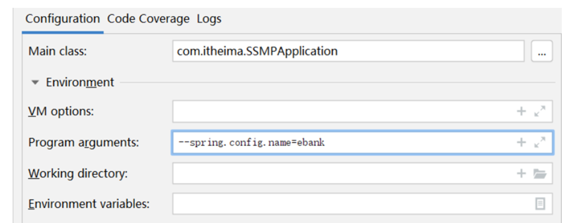
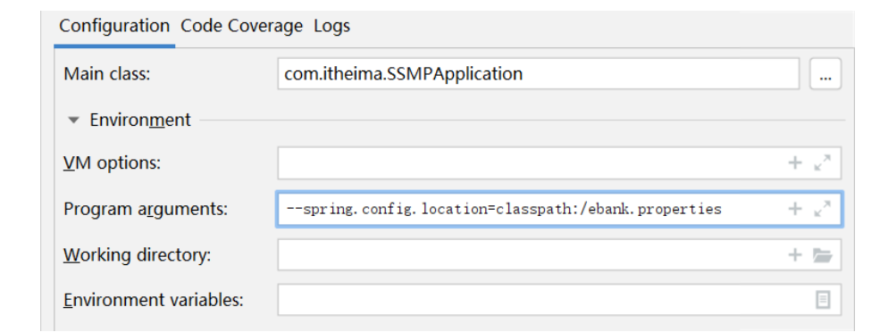

SpringBoot运维实用篇

> - SpringBoot程序的打包与运行
> - 配置高级
> - 多环境开发
> - 日志


## YW-1.SpringBoot程序的打包与运行

​		企业项目上线为了保障环境适配性会采用下面流程发布项目，这里不讨论此过程。

1. 开发部门使用Git、SVN等版本控制工具上传工程到版本服务器
2. 服务器使用版本控制工具下载工程
3. 服务器上使用Maven工具在当前真机环境下重新构建项目
4. 启动服务

​	

### **程序打包**

​		SpringBoot程序是基于Maven创建的，在Maven中提供有打包的指令，叫做package。本操作可以在Idea环境下执行。

```JAVA
mvn package
```

​		打包后会产生一个与工程名类似的jar文件，其名称是由模块名+版本号+.jar组成的。

### **程序运行**

​		程序包打好以后，就可以直接执行了。在程序包所在路径下，执行指令。

```JAVA
java -jar 工程包名.jar
```

​		执行程序打包指令后，程序正常运行，与在Idea下执行程序没有区别。

​		<font color="#ff0000"><b>特别关注</b></font>：在使用向导创建SpringBoot工程时，pom.xml文件中会有如下配置，这一段配置千万不能删除，否则打包后无法正常执行程序。

```XML
<build>
    <plugins>
        <plugin>
            <groupId>org.springframework.boot</groupId>
            <artifactId>spring-boot-maven-plugin</artifactId>
        </plugin>
    </plugins>
</build>
```


### SpringBoot程序打包

​	在SpringBoot工程的pom.xml中有`spring-boot-maven-plugin`，用于将当前程序打包成一个可以独立运行的程序包。

​	SpringBoot程序添加配置后会打出一个特殊的包，包含Spring框架部分功能，原始工程内容，原始工程依赖的jar包

1. 首先读取`MANIFEST.MF`文件中的`Main-Class`属性，用来标记执行java -jar命令后运行的类
3. `JarLauncher类`执行时会找到`Start-Class`属性，也就是启动类类名
4. 运行启动类时会运行当前工程的内容
5. 运行当前工程时会使用依赖的jar包，从lib目录中查找


### 命令行启动常见问题及解决方案

​		各位小伙伴在DOS环境下启动SpringBoot工程时，可能会遇到端口占用的问题。给大家一组命令，不用深入学习，备用吧。

```JAVA
# 查询端口
netstat -ano
# 查询指定端口
netstat -ano |findstr "端口号"
# 根据进程PID查询进程名称
tasklist |findstr "进程PID号"
# 根据PID杀死任务
taskkill /F /PID "进程PID号"
# 根据进程名称杀死任务
taskkill -f -t -im "进程名称"
```

​	

### SpringBoot项目快速启动（Linux版）

其实对于Linux系统下的程序运行与Windows系统下的程序运行差别不大，命令还是那组命令，只不过各位小伙伴可能对Linux指令不太熟悉，结果就会导致各种各样的问题发生。比如防火墙如何关闭，IP地址如何查询，JDK如何安装等等。

## YW-2.配置高级

### YW-2-1.临时属性设置

SpringBoot提供了灵活的配置方式，如果你发现你的项目中有个别属性需要重新配置，可以使用临时属性的方式快速修改某些配置。方法也特别简单，在启动的时候添加上对应参数就可以了。

```JAVA
java –jar springboot.jar –-server.port=80
```

​		上面的命令是启动SpringBoot程序包的命令，在命令输入完毕后，空一格，然后输入两个-号。下面按照属性名=属性值的形式添加对应参数就可以了。记得，这里的格式不是yaml中的书写格式，当属性存在多级名称时，中间使用点分隔，和properties文件中的属性格式完全相同。

​		如果你发现要修改的属性不止一个，可以按照上述格式继续写，属性与属性之间使用空格分隔。

```JAVA
java –jar springboot.jar –-server.port=80 --logging.level.root=debug
```


#### **属性加载优先级**

​		官方文档配置方式，就可以查看配置读取的优先顺序。地址奉上：[https://docs.spring.io/spring-boot/docs/current/reference/html/spring-boot-features.html#boot-features-external-config](https://docs.spring.io/spring-boot/docs/current/reference/html/spring-boot-features.html)

**总结**

1. 使用jar命令启动SpringBoot工程时可以使用临时属性替换配置文件中的属性
2. 临时属性添加方式：java –jar 工程名.jar –-属性名=值
3. 多个临时属性之间使用空格分隔
4. 临时属性必须是当前boot工程支持的属性，否则设置无效


#### 开发环境中使用临时属性

​		打开SpringBoot引导类的运行界面，在里面找到配置项。其中Program arguments对应的位置就是添加临时属性的。

​		我们运行main方法的时候，如果想使用main方法的参数，也就是下面的args参数，就是在上面这个位置添加的参数。args把参数传递给run方法。

```JAVA
public static void main(String[] args) {
    SpringApplication.run(SSMPApplication.class,args);
}
```

**总结**

1. 启动SpringBoot程序时，可以选择是否使用命令行属性为SpringBoot程序传递启动属性

### YW-2-2.配置文件分类

SpringBoot提供了配置文件和临时属性的方式来对程序进行配置。`SpringBoot提供了4级配置文件`分别是：

- `类路径下配置文件`（一直使用的是这个，也就是resources目录中的application.yml文件）
- `类路径下config目录下配置文件`
- `程序包所在目录中配置文件`
- `程序包所在目录中config目录下配置文件`

上面4个文件的加载优先顺序为

1. file ：config/application.yml **【最高】**
2. file ：application.yml
3. classpath：config/application.yml
4. classpath：application.yml  **【最低】**

​		那为什么设计这种多种呢？说一个最典型的应用吧。

- 场景A：你作为一个开发者，你做程序的时候为了方便自己写代码，配置的数据库肯定是连接你自己本机的，咱们使用4这个级别，也就是之前一直用的application.yml。
- 场景B：现在项目开发到了一个阶段，要联调测试了，连接的数据库是测试服务器的数据库，肯定要换一组配置吧。你可以选择把你之前的文件中的内容都改了，目前还不麻烦。
- 场景C：测试完了，一切OK。你继续写你的代码，你发现你原来写的配置文件被改成测试服务器的内容了，你要再改回来。现在明白了不？场景B中把你的内容都改掉了，你现在要重新改回来，以后呢？改来改去吗？

​		解决方案很简单，用上面的3这个级别的配置文件就可以快速解决这个问题，再写一个配置就行了。两个配置文件共存，因为config目录中的配置加载优先级比你的高，所以配置项如果和级别4里面的内容相同就覆盖了，这样是不是很简单？

​		级别1和2什么时候使用呢？程序打包以后就要用这个级别了，管你程序里面配置写的是什么？我的级别高，可以轻松覆盖你，就不用考虑这些配置冲突的问题了。

**总结**

1. 配置文件分为4种

   - 项目类路径配置文件：服务于开发人员本机开发与测试
   - 项目类路径config目录中配置文件：服务于项目经理整体调控
   - 工程路径配置文件：服务于运维人员配置涉密线上环境
   - 工程路径config目录中配置文件：服务于运维经理整体调控

2. 多层级配置文件间的属性采用叠加并覆盖的形式作用于程序

    

### YW-2-3.自定义配置文件

​	  自定义配置文件方式有如下两种：

**方式一：使用临时属性设置配置文件名，注意仅仅是名称，不要带扩展名**



**方式二：使用临时属性设置配置文件路径，这个是全路径名**



​		也可以设置加载多个配置文件

​		使用的属性一个是`spring.config.name`，另一个是`spring.config.location`，这个一定要区别清楚。


**总结**

1. 配置文件可以修改名称，通过启动参数设定
2. 配置文件可以修改路径，通过启动参数设定
3. 微服务开发中配置文件通过配置中心进行设置


## YW-3.多环境开发

>  常见的多环境开发主要兼顾3种环境设置，开发环境——自己用的，测试环境——自己公司用的，生产环境——甲方爸爸用的。

### YW-3-1.多环境开发（yaml单一文件版）	

​		针对不同的环境设置不同的配置属性即可：如设计两组环境,中间使用三个减号分隔开,并分别起名字，用哪一个，设置默认启动

```yaml
spring:
	profiles:
		active: pro		# 启动pro
---
spring:
	profiles: pro
server:
	port: 80
---
spring:
	profiles: dev
server:
	port: 81
```

​		其中关于环境名称定义上述格式是过时格式，标准格式如下

```yaml
spring:
	config:
    	activate:
        	on-profile: pro
```

**总结**

1. 多环境开发需要设置若干种常用环境，例如开发、生产、测试环境
2. yaml格式中设置多环境使用`---`区分环境设置边界
3. 每种环境的区别在于加载的配置属性不同
4. 启用某种环境时需要指定启动时使用该环境


### YW-3-2.多环境开发（yaml多文件版）	

**主配置文件**

```yaml
spring:
	profiles:
		active: pro		# 启动pro
```

**环境配置文件**使用文件名区分。

**application-pro.yaml**

```yaml
server:
	port: 80
```

**application-dev.yaml**

```yaml
server:
	port: 81
```

​		文件的命名规则为：application-环境名.yml。

- `主配置文件中设置公共配置（全局）`
- `环境分类配置文件中常用于设置冲突属性（局部）`


### YW-3-3.多环境开发（properties多文件版）

​		SpringBoot最早期提供的配置文件格式是properties格式的，这种格式的多环境配置也了解一下吧。

**主配置文件**

```properties
spring.profiles.active=pro
```

**环境配置文件**

**application-pro.properties**

```properties
server.port=80
```

**application-dev.properties**

```properties
server.port=81
```

​		文件的命名规则为：application-环境名.properties。

**总结**

1. properties文件多环境配置仅支持多文件格式


### YW-3-4.多环境开发独立配置文件书写技巧

​	**准备工作**

​		将所有的配置根据功能对配置文件中的信息进行拆分，并制作成独立的配置文件，命名规则如下

- application-devDB.yml
- application-devRedis.yml
- application-devMVC.yml

**使用**

​		使用`include`属性在激活指定环境的情况下，同时对多个环境进行加载使其生效，多个环境间使用逗号分隔

```yaml
spring:
	profiles:
    	active: dev
        include: devDB,devRedis,devMVC
```

​		比较一下，现在相当于加载dev配置时，再加载对应的3组配置，从结构上就很清晰，用了什么，对应的名称是什么

**注意**

​		`当主环境dev与其他环境有相同属性时，主环境属性生效；其他环境中有相同属性时，最后加载的环境属性生效`

**改良**

​		但是上面的设置也有一个问题，比如我要切换dev环境为pro时，include也要修改。因为include属性只能使用一次，这就比较麻烦了。SpringBoot从2.4版开始使用`group`属性替代`include`属性，降低了配置书写量。简单说就是我先写好，你爱用哪个用哪个。

```yaml
spring:
	profiles:
    	active: dev
        group:
        	"dev": devDB,devRedis,devMVC
      		"pro": proDB,proRedis,proMVC
      		"test": testDB,testRedis,testMVC
```

​		现在再来看，如果切换dev到pro，只需要改一下是不是就结束了？完美！


### YW-3-5.多环境开发控制

​		maven和SpringBoot同时设置多环境的话怎么搞。`SpringBoot应该听maven的`。整个确认后下面就好做了。大体思想如下：

- 先在maven环境中设置用什么具体的环境
- 在SpringBoot中读取maven设置的环境即可

**maven中设置多环境（使用属性方式区分环境）**

```xml
<profiles>
    <profile>
        <id>env_dev</id>
        <properties>
            <profile.active>dev</profile.active>
        </properties>
        <activation>
            <activeByDefault>true</activeByDefault>		<!--默认启动环境-->
        </activation>
    </profile>
    <profile>
        <id>env_pro</id>
        <properties>
            <profile.active>pro</profile.active>
        </properties>
    </profile>
</profiles>
```

**SpringBoot中读取maven设置值**

```yaml
spring:
	profiles:
    	active: @profile.active@
```

​		`上面的@属性名@就是读取maven中配置的属性值的语法格式。`

**总结**

1. 当Maven与SpringBoot同时对多环境进行控制时，以Mavn为主，SpringBoot使用@..@占位符读取Maven对应的配置属性值
2. 基于SpringBoot读取Maven配置属性的前提下，如果在Idea下测试工程时pom.xml每次更新需要手动compile方可生效


## YW-4.日志

> - 编程期调试代码
> - 运营期记录信息
> - 记录日常运营重要信息（峰值流量、平均响应时长……）
> - 记录应用报错信息（错误堆栈）
> - 记录运维过程数据（扩容、宕机、报警……）


#### YW-4-1.代码中使用日志工具记录日志

​		日志的使用格式非常固定，直接上操作步骤：

**步骤①**：添加日志记录操作

```JAVA
@RestController
@RequestMapping("/books")
public class BookController extends BaseClass{
    private static final Logger log = LoggerFactory.getLogger(BookController.class);
    @GetMapping
    public String getById(){
        log.debug("debug...");
        log.info("info...");
        log.warn("warn...");
        log.error("error...");
        return "springboot is running...2";
    }
}
```

​		上述代码中log对象就是用来记录日志的对象，下面的log.debug，log.info这些操作就是写日志的API了。

**步骤②**：设置日志输出级别

​		日志设置好以后可以根据设置选择哪些参与记录。这里是根据日志的级别来设置的。日志的级别分为6种，分别是：

- TRACE：运行堆栈信息，使用率低
- DEBUG：程序员调试代码使用
- INFO：记录运维过程数据
- WARN：记录运维过程报警数据
- ERROR：记录错误堆栈信息
- FATAL：灾难信息，合并计入ERROR

​		一般情况下，开发时候使用DEBUG，上线后使用INFO，运维信息记录使用WARN即可。下面就设置一下日志级别：

​		这么设置太简单粗暴了，日志系统通常都提供了细粒度的控制

```yaml
# 开启debug模式，输出调试信息，常用于检查系统运行状况
debug: true

# 设置日志级别，root表示根节点，即整体应用日志级别
logging:
	level:
    	root: debug
```

​		还可以再设置更细粒度的控制

**步骤③**：设置日志组，控制指定包对应的日志输出级别，也可以直接控制指定包对应的日志输出级别

```yaml
logging:
	# 设置日志组
    group:
    	# 自定义组名，设置当前组中所包含的包
        ebank: com.itheima.controller
    level:
    	root: warn
        # 为对应组设置日志级别
        ebank: debug
    	# 为对包设置日志级别
        com.itheima.controller: debug
```

​		说白了就是总体设置一下，每个包设置一下，如果感觉设置的麻烦，就先把包分个组，对组设置，没了，就这些。

**总结**

1. 日志用于记录开发调试与运维过程消息
2. 日志的级别共6种，通常使用4种即可，分别是DEBUG，INFO,WARN,ERROR
3. 可以通过日志组或代码包的形式进行日志显示级别的控制


#### 教你一招：优化日志对象创建代码

​		写代码的时候每个类都要写创建日志记录对象，这个可以优化一下，使用前面用过的lombok技术给我们提供的工具类即可。

```JAVA
@RestController
@RequestMapping("/books")
public class BookController extends BaseClass{
    private static final Logger log = LoggerFactory.getLogger(BookController.class);	//这一句可以不写了
}
```

​		导入lombok后使用注解搞定，日志对象名为log

```JAVA
@Slf4j		//这个注解替代了下面那一行
@RestController
@RequestMapping("/books")
public class BookController extends BaseClass{
    private static final Logger log = LoggerFactory.getLogger(BookController.class);	//这一句可以不写了
}
```

**总结**

1. 基于lombok提供的@Slf4j注解为类快速添加日志对象


#### YW-4-2.日志输出格式控制

​		日志已经能够记录了，但是目前记录的格式是SpringBoot给我们提供的，如果想自定义控制就需要自己设置了。先分析一下当前日志的记录格式。


​		对于单条日志信息来说，日期，触发位置，记录信息是最核心的信息。级别用于做筛选过滤，PID与线程名用于做精准分析。了解这些信息后就可以DIY日志格式了。本课程不做详细的研究，有兴趣的小伙伴可以学习相关的知识。下面给出课程中模拟的官方日志模板的书写格式，便于大家学习。

```yaml
logging:
	pattern:
    	console: "%d %clr(%p) --- [%16t] %clr(%-40.40c){cyan} : %m %n"
```

**总结**

1. 日志输出格式设置规则


#### YW-4-3.日志文件

​		日志信息显示，记录已经控制住了，下面就要说一下日志的转存了。日志不能仅显示在控制台上，要把日志记录到文件中，方便后期维护查阅。

​		对于日志文件的使用存在各种各样的策略，例如每日记录，分类记录，报警后记录等。这里主要研究日志文件如何记录。

​		记录日志到文件中格式非常简单，设置日志文件名即可。

```YAML
logging:
	file:
    	name: server.log
```

​		虽然使用上述格式可以将日志记录下来了，但是面对线上的复杂情况，一个文件记录肯定是不能够满足运维要求的，通常会每天记录日志文件，同时为了便于维护，还要限制每个日志文件的大小。下面给出日志文件的常用配置方式：

```YAML
logging:
	logback:
    	rollingpolicy:
        	max-file-size: 3KB
            file-name-pattern: server.%d{yyyy-MM-dd}.%i.log
```

​		以上格式是基于logback日志技术设置每日日志文件的设置格式，要求容量到达3KB以后就转存信息到第二个文件中。文件命名规则中的%d标识日期，%i是一个递增变量，用于区分日志文件。

**总结**

1. 日志记录到文件
2. 日志文件格式设置


## 运维实用篇完结

​	


